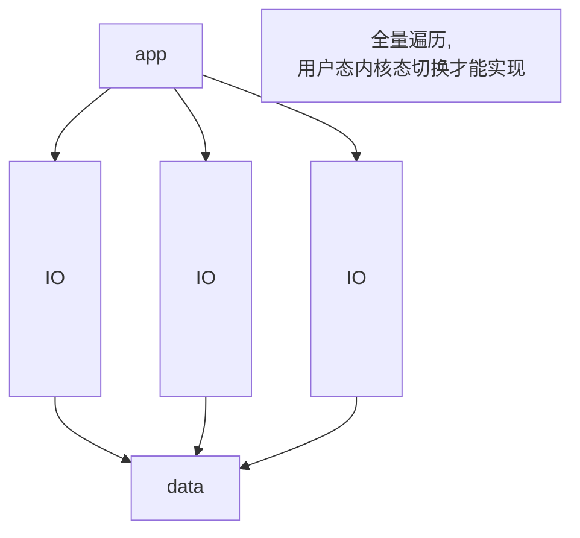
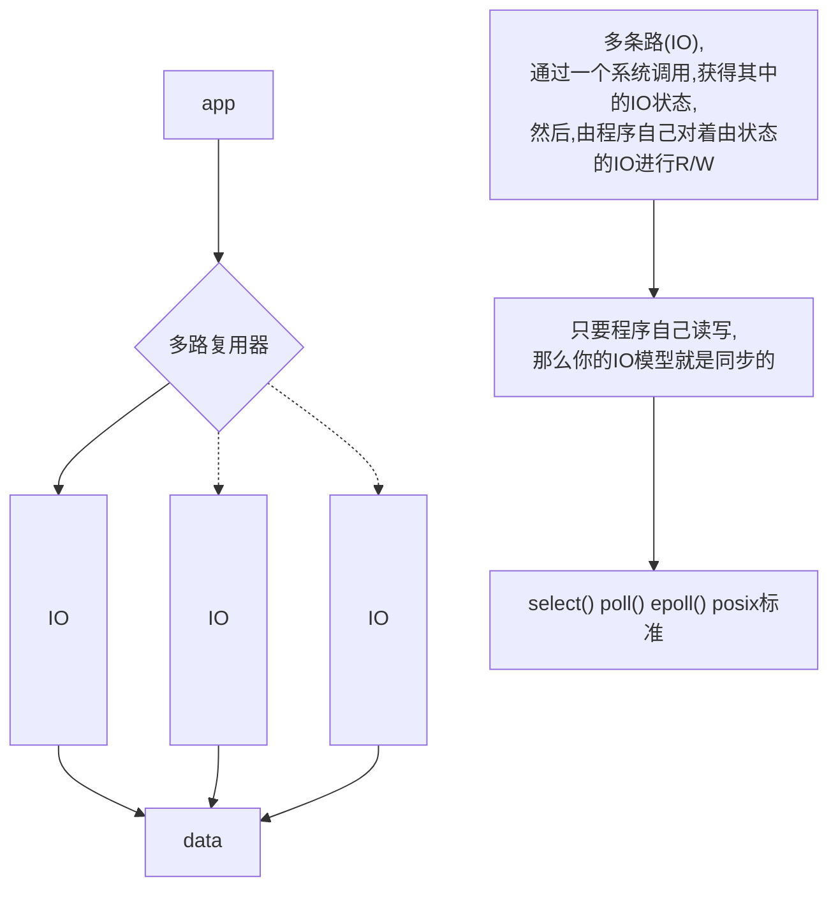
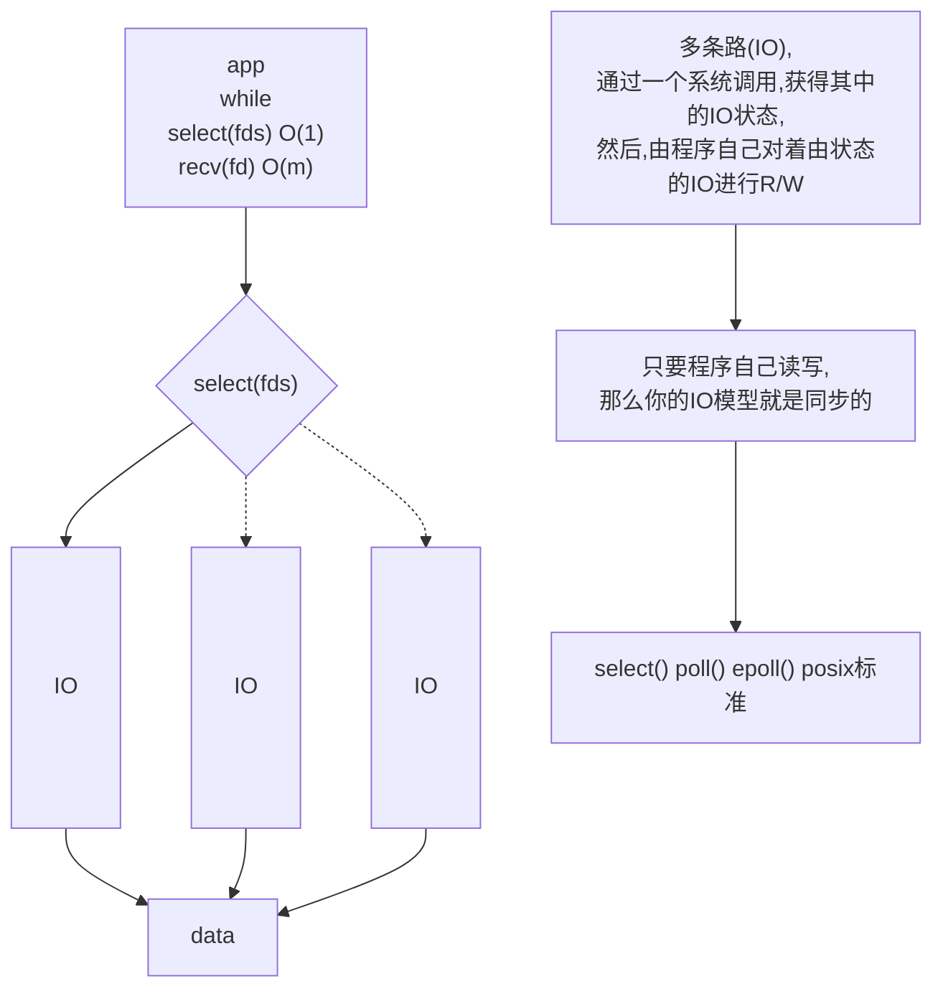

#### C10K问题

​			单机链接(connect)一万(10k)的连接如何高并发.

​			]www.kegel.com/c10k.html

#### 网络IO

BIO accept() recv()

随着链接数的变大

一万个链接是否抛出一万个线程(

- [x] 浪费内存的空间

- [x] 浪费内核态用户态的切换

- [ ] 浪费内核调度)

```
tcpdump -nn -i eth0 port 9090
```

客户端调用有一个小

bug

循环一次

重复端口号访问没有ACK回应

````
lemcoden@unbuntu:~/文档/bigdata/datawarehouse$ route -n
内核 IP 路由表
目标            网关            子网掩码        标志  跃点   引用  使用 接口
0.0.0.0         192.168.0.1     0.0.0.0         UG    100    0        0 enp4s0
169.254.0.0     0.0.0.0         255.255.0.0     U     1000   0        0 enp4s0
192.168.0.0     0.0.0.0         255.255.255.0   U     100    0        0 enp4s0
````

高并发情况下,BIO模型处理数据慢在于

,应付多连接,开启多个线程linux需要重复调用clone函数在底层开启多个轻量级进程


池化


即使池化准备之后,多线程的切换仍然很慢


BIO的弊端

阻塞(BLOCKING)


内核系统阻塞的调用模型


非阻塞调用

```
程序运行的最大资源
lemcoden@unbuntu:~$ ulimit -a
vi /etc/security/limits.conf 
```


```
lemcoden@unbuntu:~$ man 2 socket
SOCK_NONBLOCK   Set the O_NONBLOCK file status flag on  the  open  file
                       description  (see  open(2)) referred to by the new file
                       descriptor.  Using this flag saves extra calls  to  fc‐
                       ntl(2) to achieve the same result.

```

> 模拟windows本地开线程很慢,和真实高并发场景有很大的误差

```
查看系统内核可开启的最大数量的文件描述符
lemcoden@unbuntu:~$ cat /proc/sys/fs/file-max 
9223372036854775807
```

优势:

​	通过1个或几个线程来解决,来个解决N个IO连接的处理

NIO的问题:

​	C10K,IO连接的数量达到一万个,

​	每循环一次:0(n)复杂度,recv调用很多的调用是无意义的

​	机组:系统调用

*read 无罪 无效的无用的read别调起*





只关注IO:不关注从IO读写完之后的事情

* 同步:app自己R/W

* 异步:kernel完成:R/W 没有访问IO , buffer win: iocp


* 阻塞:BLOCKING

* 非阻塞:NONBlOCKING


linux,以及成熟的框架netty

* 同步阻塞:同步,程序自己读取,调用方法一直等待有效返回

* 同步非阻塞:程序自己读取,调用方法一瞬间,给出是否读到(自己要解决下一次啥时候再去读)


* 异步:尽量不要去讨论,由因为现在我们只讨论IO模型下,linux,目前没有通用内核的异步处理方案
* 异步:阻塞?异步非阻塞

```
lemcoden@unbuntu:~$ man 2 select
NAME
       select,  pselect,  FD_CLR,  FD_ISSET, FD_SET, FD_ZERO - synchronous I/O
       multiplexing
		int select(int nfds, fd_set *readfds, fd_set *writefds,
                  fd_set *exceptfds, struct timeval *timeout);
NOTES
       An  fd_set is a fixed size buffer.  Executing FD_CLR() or FD_SET() with
       a value of fd that is negative or is equal to or larger than 
       FD_SETSIZE //1024大小限制,poll没有1024限制
       will result in undefined behavior.  Moreover, POSIX requires fd to be a
       valid file descriptor.

```



其实,无论NIO,SELECT,POLL 都是要遍历所有的IO,询问状态

只不过:but NIO,这个遍历的过程成本在内核态,用户态的切换

(多路复用器-1)select,poll:

​	这个遍历的过程触发了一次系统调用,用户态内核态的切换,过程中,把fds传递给内核,内核重新根据传过来的fds,遍历,修改状态

多路复用器:select poll的弊端,问题

1. 每次都要重新,重复传递fds

2. 每次,内核被调用了之后,针对这次调用,触发遍历fds全量的复杂度

细节插入:

​	


```
lemcoden@unbuntu:~$ cat /proc/sys/fs/epoll/max_user_watches 
3316367
```

设置此值可以快速断开wait连接

```
lemcoden@unbuntu:~$ sysctl -a | grep reuse
net.ipv4.t0_tw_reuse = 0
```


IO中事件是第一步,读写是第二步