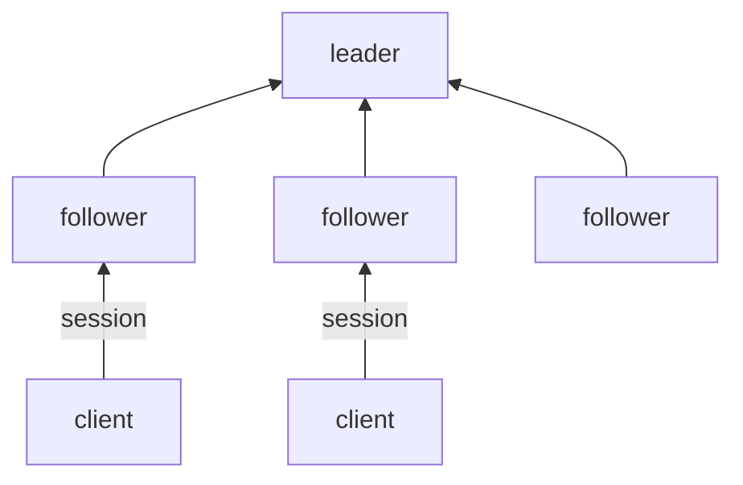
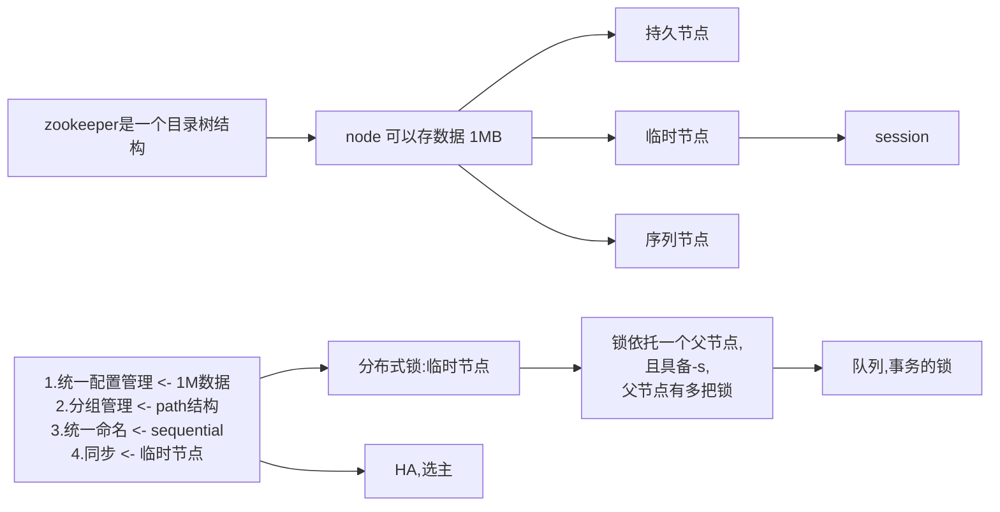
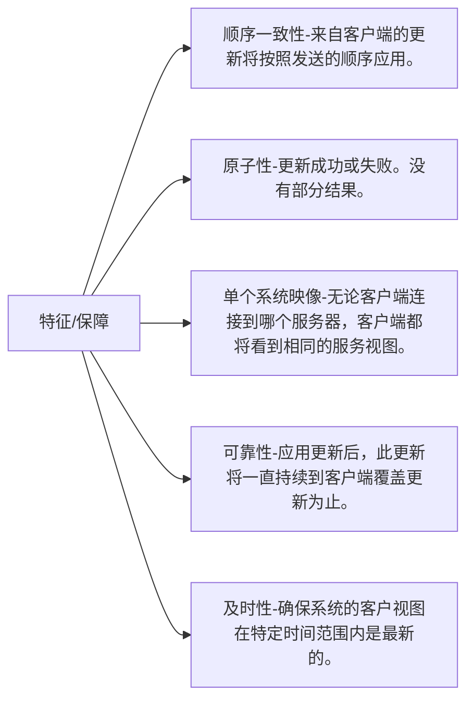
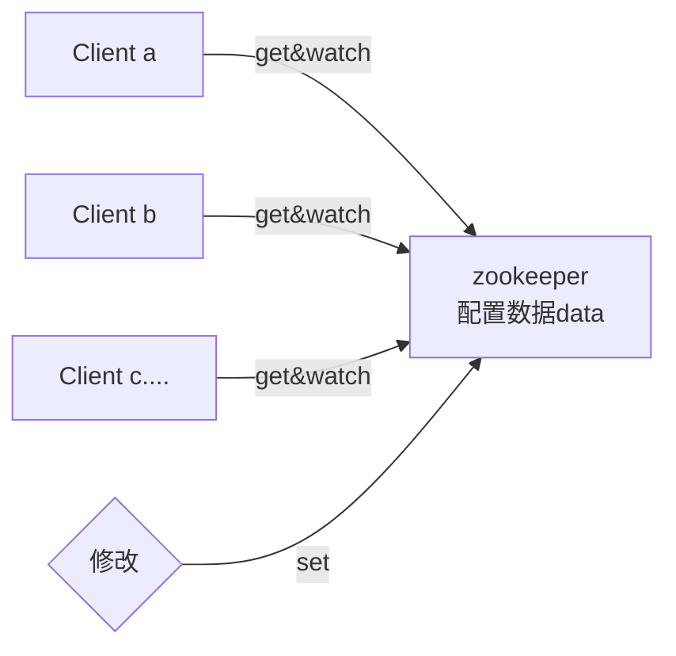

### 分布式协调服务

* zookeeper比较简单,提供了简单的原语API,但是可以通过这些原语构建高级别复杂的服务.比如同步,配置维护以及组和命名.

* ZooKeeper提供的名称空间与标准文件系统的名称空间非常相似。名称是由斜杠（/）分隔的一系列路径元素。ZooKeeper名称空间中的每个节点都由路径标识。

* 复制集群区别于sharding分片集群,主从架构 ---> 单点

* zookeeper文件存储在内存中



zookeeper 可以快速自我修复:

1. leader 肯定会挂

2. 服务不可用

3. 不可靠的集群

4. zk集群极其高可用
5. 如果有一种方式可以快速的恢复出一个leader

zookeeper有2种运行状态

1.可用状态

2.不可用状态

3.不可用状态恢复到可用状态



session很好的解决了分布式锁的问题



#### 配置

配置文件

```
#服务心跳间隔
tickTime=2000
#follower初始化允许等待链接的心跳次数
initLimit=10
#投票操作leader允许等待链接的心跳次数
syncLimit=5
#zk数据目录
dateDir=/var/mashibing/zk
#端口号
clientPort=2181
```

前端运行server

```
[lemcoden@hadoop01 conf]$ zkServer.sh start-foreground
```

运行client,实验验证

1.create 后面除了要接创建的目录外,还需要有具体的字节内容,如果为空则可以使用""代替

```
[lemcoden@hadoop02 ~]$ zkCli.sh 
[zk: localhost:2181(CONNECTED) 1] ls /
[zookeeper]
[zk: localhost:2181(CONNECTED) 2] create /ooxx   
[zk: localhost:2181(CONNECTED) 3] ls /
[zookeeper]
[zk: localhost:2181(CONNECTED) 4] create /ooxx ""
Created /ooxx
[zk: localhost:2181(CONNECTED) 6] create /ooxx/xxoo ""
Created /ooxx/xxoo
[zk: localhost:2181(CONNECTED) 7] ls /
[zookeeper,ooxx]
[zk: localhost:2181(CONNECTED) 8] ls /ooxx
[xxoo]
[zk: localhost:2181(CONNECTED) 9] get /ooxx

cZxid = 0x3100000002
ctime = Tue Nov 24 23:34:15 CST 2020
mZxid = 0x3100000002
mtime = Tue Nov 24 23:34:15 CST 2020
pZxid = 0x3100000003
cversion = 1
dataVersion = 0
aclVersion = 0
ephemeralOwner = 0x0
dataLength = 0
numChildren = 1
[zk: localhost:2181(CONNECTED) 10] set /ooxx "hello"
cZxid = 0x3100000002
ctime = Tue Nov 24 23:34:15 CST 2020
mZxid = 0x3100000004
mtime = Tue Nov 24 23:39:09 CST 2020
pZxid = 0x3100000003
cversion = 1
dataVersion = 1
aclVersion = 0
ephemeralOwner = 0x0
dataLength = 5
numChildren = 1
[zk: localhost:2181(CONNECTED) 11] get /ooxx
hello
cZxid = 0x3100000002				
ctime = Tue Nov 24 23:34:15 CST 2020
mZxid = 0x3100000004
mtime = Tue Nov 24 23:39:09 CST 2020
pZxid = 0x3100000003
cversion = 1
dataVersion = 1
aclVersion = 0
ephemeralOwner = 0x0
dataLength = 5
numChildren = 1

[zk: localhost:2181(CONNECTED) 12] set /ooxx/xxoo "sdfsdf"
cZxid = 0x3100000003
ctime = Tue Nov 24 23:37:25 CST 2020
mZxid = 0x3100000005
mtime = Tue Nov 24 23:52:14 CST 2020
pZxid = 0x3100000003
cversion = 0
dataVersion = 1
aclVersion = 0
ephemeralOwner = 0x0
dataLength = 6
numChildren = 0
[zk: localhost:2181(CONNECTED) 13] create /ooxx/oxox "sdfsdf"
Created /ooxx/oxox
[zk: localhost:2181(CONNECTED) 14] get /ooxx/oxox
sdfsdf
cZxid = 0x3100000006
ctime = Tue Nov 24 23:53:13 CST 2020
mZxid = 0x3100000006
mtime = Tue Nov 24 23:53:13 CST 2020
pZxid = 0x3100000006
cversion = 0
dataVersion = 0
aclVersion = 0
ephemeralOwner = 0x0
dataLength = 6
numChildren = 0

[zk: localhost:2181(CONNECTED) 18] quit
[zk: localhost:2181(CONNECTED) 7] ls /
[zookeeper,ooxx]

```

cZxid = 0x3100000002 : 

* zookeeper顺序执行的id,leader维护了一个事务的单调计数器,c前缀为create
* 低32位为递增ID,高32位表示leader的纪元,高32位为0部分省略

mZxid = 0x3100000004:

* 修改的事务ID

pZxid = 0x3100000006:

* 当前节点下最后的创建事务ID

ephemeralOwner = 0x0:

* 临时持有者i的SessionId,为0说明没有,即永久节点
* SessionId由所有节点统一持有,发生failover的时候,sessionID不会变,也就是说创建的临时目录不会丢失链接session

```
[zk: localhost:2181(CONNECTED) 2] create -e /xoxo "sdfsdf"
Created /xoxo
[zk: localhost:2181(CONNECTED) 3] get /xoxo
sdfsdf
cZxid = 0x3100000009
ctime = Wed Nov 25 00:23:38 CST 2020
mZxid = 0x3100000009
mtime = Wed Nov 25 00:23:38 CST 2020
pZxid = 0x3100000009
cversion = 0
dataVersion = 0
aclVersion = 0
ephemeralOwner = 0x175fad5aff40001
dataLength = 6
numChildren = 0
```

create -s  自动区分创建,带序列号后缀

```
[zk: localhost:2181(CONNECTED) 0] create -s /abc/xxx "fsdfd"
Node does not exist: /abc/xxx
[zk: localhost:2181(CONNECTED) 1] create  /abc ""           
Created /abc
[zk: localhost:2181(CONNECTED) 2] create -s /abc/xxx "fsdfd"
Created /abc/xxx0000000000
[zk: localhost:2181(CONNECTED) 5] ls /abc 
[xxx0000000000]
[zk: localhost:2181(CONNECTED) 6] create -s /abc/xxx "fsdfd"
Created /abc/xxx0000000001
[zk: localhost:2181(CONNECTED) 7] ls /abc                   
[xxx0000000001, xxx0000000000]
[zk: localhost:2181(CONNECTED) 8]
```

```
[lemcoden@hadoop02 ~]$ netstat -natp | egrep '(3888|2888)'
(Not all processes could be identified, non-owned process info
 will not be shown, you would have to be root to see it all.)
tcp6       0      0 192.168.0.102:3888      :::*                    LISTEN      3644/java           
tcp6       0      0 192.168.0.102:54730     192.168.0.103:2888      ESTABLISHED 3644/java           
tcp6       0      0 192.168.0.102:3888      192.168.0.103:51826     ESTABLISHED 3644/java           
tcp6       0      0 192.168.0.102:3888      192.168.0.104:54538     ESTABLISHED 3644/java 
```

3888端口用于选主投票

2888leader接受write请求

#### zookeeper 分布协调 ,协调啥?

1.配置:本地文件 ----> 集群规模很大的话,则需要将配置文件放在一个地方,大家都来取 ----> zookeeper在分布式配置的优势在与,只要注册了watcher有谁修改了配置,都会回调watcher的方法

2.分布式锁


配置中心 = 注册发现



