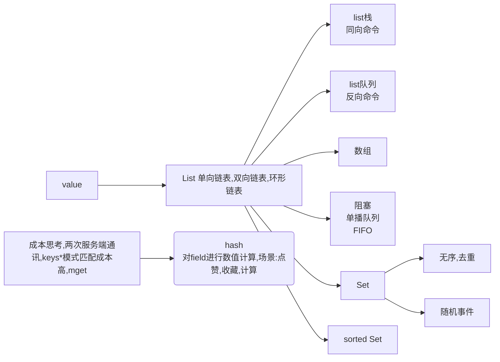
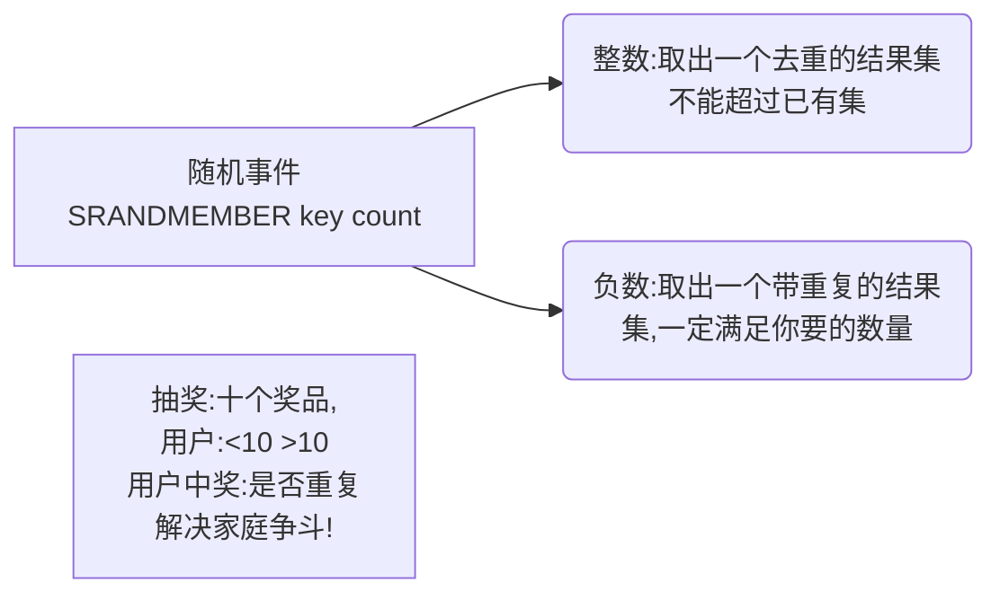
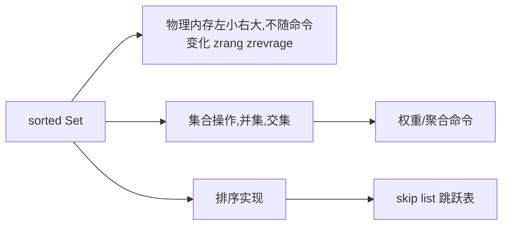
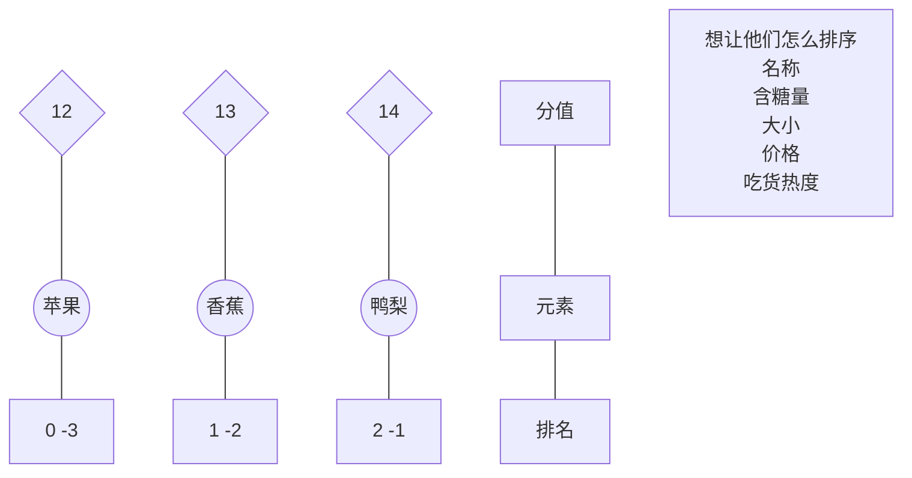
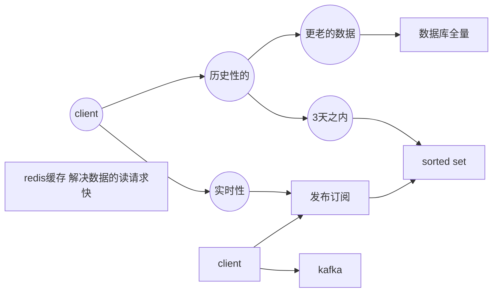
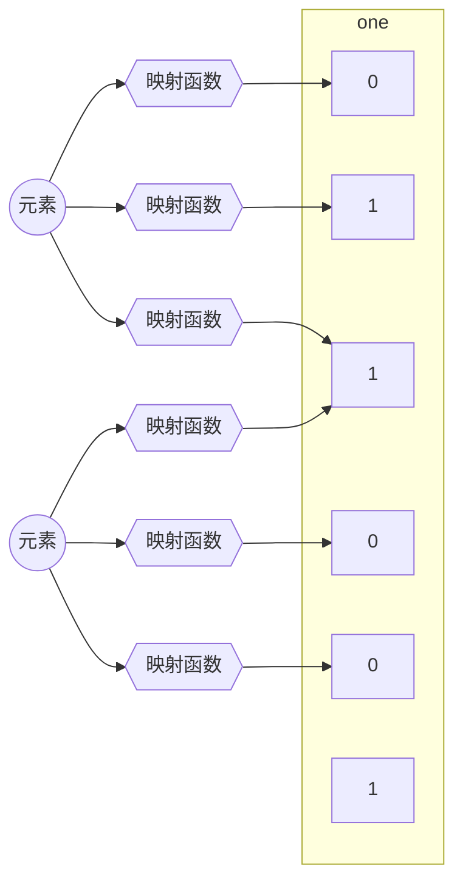
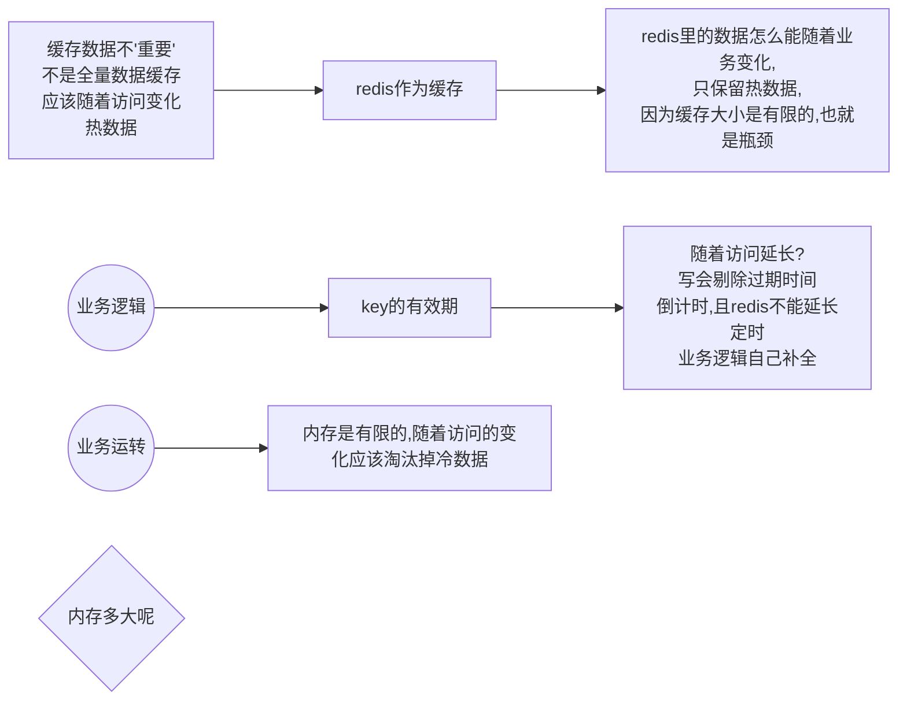

### redis API 及其设计




<!--more-->







#### 栈

```
127.0.0.1:6379> LPUSH k1 a b c d e f
(integer) 6
127.0.0.1:6379> RPUSH k2 a b c d e f
(integer) 6
127.0.0.1:6379> lpop k1
"f"
127.0.0.1:6379> lpop k1 
"e"
127.0.0.1:6379> lpop k1
"d"
```

#### 队列

```
127.0.0.1:6379> lpop k2
"a"
127.0.0.1:6379> lpop k2
"b"
127.0.0.1:6379> lpop k2
"c"
```

#### range index set 数组

```
127.0.0.1:6379> LRANGE k1 0 -1
1) "f"
2) "e"
3) "d"
4) "c"
5) "b"
6) "a"
127.0.0.1:6379> LINDEX k1 -1
"a"
127.0.0.1:6379> LSET k1 3 XXXX
OK
127.0.0.1:6379> LRANGE k1 0 -1
1) "f"
2) "e"
3) "d"
4) "XXXX"
5) "b"
6) "a"
```

#### remove insert数组

```
127.0.0.1:6379> lpush k3 1 a 2 b 3 a 4 c 5 a 6 d
(integer) 12
127.0.0.1:6379> LRANGE k3 0 -1
 1) "d"
 2) "6"
 3) "a"
 4) "5"
 5) "c"
 6) "4"
 7) "a"
 8) "3"
 9) "b"
10) "2"
11) "a"
12) "1"
127.0.0.1:6379> LREM k3 2 a
(integer) 2
127.0.0.1:6379> LRANGE k3 0 -1
 1) "d"
 2) "6"
 3) "5"
 4) "c"
 5) "4"
 6) "3"
 7) "b"
 8) "2"
 9) "a"
10) "1"
127.0.0.1:6379> LINSERT k3 after 6 a
(integer) 11
127.0.0.1:6379> LINSERT k3 before 3 a
(integer) 12
127.0.0.1:6379> LRANGE k3 0 -1
 1) "d"
 2) "6"
 3) "a"
 4) "5"
 5) "c"
 6) "4"
 7) "a"
 8) "3"
 9) "b"
10) "2"
11) "a"
12) "1"
127.0.0.1:6379> LLEN k3
(integer) 12
```

#### blpop数组

```
node01
127.0.0.1:6379> keys *
(empty list or set)
127.0.0.1:6379> blpop ooxx
1) "ooxx"
2) "hello"
(343.09s)
127.0.0.1:6379> BLPOP ooxx 0

node02
127.0.0.1:6379> blpop ooxx 0
1) "ooxx"
2) "world"
(25.95s)

node03
127.0.0.1:6379> RPUSH ooxx hello
(integer) 1
127.0.0.1:6379> RPUSH ooxx world
(integer) 1
127.0.0.1:6379> 
```

#### trim数组

```
127.0.0.1:6379> lpush k4 a b c d e f d fs sdf s
(integer) 10
127.0.0.1:6379> LRANGE K4 0 -1
(empty list or set)
127.0.0.1:6379> LRANGE k4 0 -1
 1) "s"
 2) "sdf"
 3) "fs"
 4) "d"
 5) "f"
 6) "e"
 7) "d"
 8) "c"
 9) "b"
10) "a"
127.0.0.1:6379> LTRIM k4 0 -1
OK
127.0.0.1:6379> LTRIM k4 2 -2
OK
127.0.0.1:6379> LRANGE k4 0 -1
1) "fs"
2) "d"
3) "f"
4) "e"
5) "d"
6) "c"
7) "b"
```

#### hash map

```
127.0.0.1:6379> HSET sean name zzl
(integer) 1
127.0.0.1:6379> HMSET sean age 18 address beijing
OK
127.0.0.1:6379> HGET sean name
"zzl"
127.0.0.1:6379> HGET sean age 
"18"
127.0.0.1:6379> HMGET sean name age
1) "zzl"
2) "18"
127.0.0.1:6379> HKEYS sean 
1) "name"
2) "age"
3) "address"
127.0.0.1:6379> HVALS sean
1) "zzl"
2) "18"
3) "beijing"
127.0.0.1:6379> HGETALL sean
1) "name"
2) "zzl"
3) "age"
4) "18"
5) "address"
6) "beijing"
127.0.0.1:6379> HINCRBYFLOAT sean age 0.5
"18.5"
127.0.0.1:6379> HGET sean age
"18.5"
127.0.0.1:6379> HINCRBYFLOAT sean age -1
"17.5"
127.0.0.1:6379> hget sean age
"17.5"
```

**应用场景:商品详情页,某商品的详细属性组**


#### set

<font color='#00ff00'>使用详解:不要刻意的在客户端调用SMEMEBERS这样的命令,这样的命令会消耗redis主机所在的网卡的吞吐量,有需求单独拆出</font>

```
127.0.0.1:6379> sadd k1 tom sean peter ooxx tom xxoo
(integer) 5
127.0.0.1:6379> SMEMBERS
(error) ERR wrong number of arguments for 'smembers' command
127.0.0.1:6379> SMEMBERS
(error) ERR wrong number of arguments for 'smembers' command
127.0.0.1:6379> SMEMBERS k1
1) "tom"
2) "peter"
3) "sean"
4) "ooxx"
5) "xxoo"
127.0.0.1:6379> SREM k1 ooxx xxoo
(integer) 2
127.0.0.1:6379> SMEMBERS k1
1) "sean"
2) "peter"
3) "tom"
127.0.0.1:6379> sadd k2 1 2 3 4 5
(integer) 5
127.0.0.1:6379> sadd k3 4 5 6 7 8
(integer) 5
127.0.0.1:6379> SMEMBERS k2
1) "1"
2) "2"
3) "3"
4) "4"
5) "5"
127.0.0.1:6379> SMEMBERS k3
1) "4"
2) "5"
3) "6"
4) "7"
5) "8"
127.0.0.1:6379> SINTER k2 k3 
1) "4"
2) "5"
127.0.0.1:6379> SINTERSTORE dest k2 k3 \\可以不用开发,但是客户端有需求需要独立开发,高并发环境下多了一次IO
(integer) 2
127.0.0.1:6379> SMEMBERS dest 
1) "4"
2) "5"
127.0.0.1:6379> SUNION k2 k3
1) "1"
2) "2"
3) "3"
4) "4"
5) "5"
6) "6"
7) "7"
8) "8"
差集带方向,更换位置即可
127.0.0.1:6379> SDIFF k2 k3 
1) "1"
2) "2"
3) "3"
127.0.0.1:6379> SDIFF k3 k2
1) "6"
2) "7"
3) "8"
```

#### randmemeber

```
127.0.0.1:6379> SADD k1 tom ooxx xxoo xoxo oxox xoox oxxo
(integer) 7
127.0.0.1:6379> SRANDMEMBER k1 5
1) "ooxx"
2) "xoox"
3) "xxoo"
4) "oxox"
5) "oxxo"
127.0.0.1:6379> SRANDMEMBER k1 10
1) "tom"
2) "ooxx"
3) "xoox"
4) "xxoo"
5) "oxox"
6) "xoxo"
7) "oxxo"
127.0.0.1:6379> SRANDMEMBER k1 -5
1) "oxxo"
2) "oxxo"
3) "xoxo"
4) "xoxo"
5) "xoxo"
127.0.0.1:6379> SRANDMEMBER k1 -10 
 1) "tom"
 2) "xxoo"
 3) "xxoo"
 4) "xxoo"
 5) "tom"
 6) "oxxo"
 7) "xoox"
 8) "oxxo"
 9) "tom"
10) "xoxo"
```

#### spop

```
127.0.0.1:6379> SPOP k1
"oxxo"
127.0.0.1:6379> SPOP k1
"tom"
127.0.0.1:6379> SPOP k1
"ooxx"
127.0.0.1:6379> SMEMBERS k1
1) "xoox"
2) "xxoo"
3) "oxox"
4) "xoxo"
```

#### sortedset



```
sorted set (物理内存左小右大)
127.0.0.1:6379> zadd k1 8 apple 2 banana  3 orange
(integer) 3
127.0.0.1:6379> ZRANGE k1 0 -1
1) "banana"
2) "orange"
3) "apple"
127.0.0.1:6379> ZRANGE k1 0 -1 withscores
1) "banana"
2) "2"
3) "orange"
4) "3"
5) "apple"
6) "8"
127.0.0.1:6379> ZRANGEBYSCORE k1 3 8
1) "orange"
2) "apple"
127.0.0.1:6379> ZRANGE 0 1
(error) ERR wrong number of arguments for 'zrange' command
127.0.0.1:6379> ZRANGE  k1 0 1
1) "banana"
2) "orange"
127.0.0.1:6379> ZREVRANGE  k1 0 1
1) "apple"
2) "orange"
127.0.0.1:6379> ZREVRANGE  k1 -2 -1
1) "orange"
2) "banana"
127.0.0.1:6379> ZSCORE k1 apple 
"8"
127.0.0.1:6379> ZRANK k1 apple
(integer) 2
127.0.0.1:6379> ZRANGE k1 0 -1 withscores 
1) "banana"
2) "2"
3) "orange"
4) "3"
5) "apple"
6) "8"
127.0.0.1:6379> ZINCRBY k1 2.5 banana 实时维护排名
"4.5"
127.0.0.1:6379> ZRANGE k1 0 -1 withscores 
1) "orange"
2) "3"
3) "banana"
4) "4.5"
5) "apple"
```

#### 集合操作

```
127.0.0.1:6379> ZADD k1 80 tom 60 sean 70 baby
(integer) 3
127.0.0.1:6379> ZADD k2 60 tom 100 sean 40 yiming
(integer) 3
127.0.0.1:6379> ZUNIONSTORE unkey 2 k1 k2
(integer) 4
127.0.0.1:6379> ZRANGE unkey 0 -1 withscores
1) "yiming"
2) "40"
3) "baby"
4) "70"
5) "tom"
6) "140"
7) "sean"
8) "160"
127.0.0.1:6379> ZUNIONSTORE unkey1 2 k1 k2 1 0.5 
(error) ERR syntax error
127.0.0.1:6379> ZUNIONSTORE unkey1 2 k1 k2 weights  1 0.5 
(integer) 4
127.0.0.1:6379> ZRANGE unkey 0 -1 withscores
1) "yiming"
2) "40"
3) "baby"
4) "70"
5) "tom"
6) "140"
7) "sean"
8) "160"
127.0.0.1:6379> ZRANGE unkey1 0 -1 withscores
1) "yiming"
2) "20"
3) "baby"
4) "70"
5) "sean"
6) "110"
7) "tom"
8) "110"
127.0.0.1:6379> ZUNIONSTORE unkey1 2 k1 k2 aggregate max
(integer) 4
127.0.0.1:6379> ZRANGE unkey1 0 -1
1) "yiming"
2) "baby"
3) "tom"
4) "sean"
127.0.0.1:6379> ZRANGE unkey1 0 -1 withscores
1) "yiming"
2) "40"
3) "baby"
4) "70"
5) "tom"
6) "80"
7) "sean"
8) "100"

```

### 进阶使用

#### pipline

多次请求压缩成一个请求.

击穿 雪崩 穿透 一致性

```
nc localhost 6379 
```

[lemcoden@hadoop01 ~]$ echo -e "set k2 99 \n incr k2 \n get k2" | nc localhost 6379
+OK
:100
$3
100

#### 发布订阅

腾讯课堂,进入聊天室才能看到新的消息,但是有历史消息存在

```
node01
127.0.0.1:6379> PUBLISH ooxx hello
(integer) 0
127.0.0.1:6379> publish ooxx helloxiaotuantuan
(integer) 1


node02
127.0.0.1:6379> SUBSCRIBE ooxx
Reading messages... (press Ctrl-C to quit)
1) "subscribe"
2) "ooxx"
3) (integer) 1
1) "message"
2) "ooxx"
3) "helloxiaotuantuan"
```



#### 事务

追求的速度,没有事务的回滚

MULTI开启事务

 ```mermaid
graph LR
	id1{client1}
	id2{client2}
	id1 --> id3["[1:exec ←→ 2:exec ] <br/>[1:get k1 2:del k1] <br/> [2:multi 1:multi] <br/> watch k1"]
	id2 --> id3
	id3 --> id4[redis]
 ```

```
node02
127.0.0.1:6379> MULTI
OK
127.0.0.1:6379> del k1
QUEUED
127.0.0.1:6379> exec
1) (integer) 0
127.0.0.1:6379> 

node01
127.0.0.1:6379> MULTI
OK
127.0.0.1:6379> get k1
QUEUED
127.0.0.1:6379> exec
1) (nil)
127.0.0.1:6379> 
```

**watch乐观锁**

```
node01
127.0.0.1:6379> WATCH k1 
OK
127.0.0.1:6379> MULTI 
OK
127.0.0.1:6379> get k1
QUEUED
127.0.0.1:6379> keys *
QUEUED
127.0.0.1:6379> exec
(nil)

nod02
127.0.0.1:6379> MULTI
OK
127.0.0.1:6379> keys *
QUEUED
127.0.0.1:6379> set k1 asdasdadsasd
QUEUED
127.0.0.1:6379> exec
1) (empty list or set)
2) OK
127.0.0.1:6379> get k1
"asdasdadsasd"
```

#### 布隆过滤器

解决缓存穿透问题.

去地址下载redis源码包

https://github.com/RedisBloom/RedisBloom/releases

解压,进入源码目录,输入make命令

将目录下的so文件copy到redis目录下

停掉redis-server

```
systemctl stop redis_6379
```

启动并挂载bloom过滤器module

```
sudo ./bin/redis-server  --loadmodule ./redisbloom.so
```

拿一点损耗换时间成本

你网站里有什么数据

有的数据拿出来

放到集合里,匹配没找到,再去数据库里查



概率解决问题

不可能百分之百阻挡

\>1%

1. 你有啥

2. 有的向bitmap中标记

3. 请求的可能被误标记

4. 但是一定概率会大量减少放行:穿透

5. 而且,成本低


| 客户端                           | 服务端              |
| -------------------------------- | ------------------- |
| 实现bloom算法<br/>自己承载bitmap | redis               |
| client<br/>实现bloom算法         | bitmap              |
| client                           | bloom.so<br/>bitmap |

 ???  bloom过滤器 的知识

布谷鸟过滤器

counting bloom

cuckcoo

```
127.0.0.1:6379> BF.ADD ooxx abc
(integer) 1
127.0.0.1:6379> BF.EXISTS ooxx abc 
(integer) 1
127.0.0.1:6379> BF.EXISTS ooxx sdfsdf
(integer) 0
```


#### redis作为数据库/缓存的区别



```
vim /etc/redis/6379.conf
个性化 基础配置
# include /path/to/local.conf
# include /path/to/other.conf
加载module
# loadmodule /path/to/my_module.so
# loadmodule /path/to/other_module.so


# bind 192.168.1.100 10.0.0.1
# bind 127.0.0.1 ::1
外部访问
protected-mode yes
后台服务模式
daemonize yes

pidfile /var/run/redis_6379.pid
0~15号
databases 16
#################### SECURITY ############
# requirepass foobared
# rename-command CONFIG ""
最大链接数
# maxclients 10000
1G~10G的范围,最大内存
# maxmemory <bytes>
# maxmemory-policy noeviction
LRU 多久没碰它
LFU 碰了多少次
```

```
127.0.0.1:6379> keys *
(empty list or set)
127.0.0.1:6379> set k1 aaa ex 20
OK
127.0.0.1:6379> ttl k1
(integer) 17
127.0.0.1:6379> ttl k1
(integer) 15
127.0.0.1:6379> get k1
"aaa"
127.0.0.1:6379> ttl k1
(integer) 1
127.0.0.1:6379> get k1
(nil)
127.0.0.1:6379> set k1 aaa
OK
127.0.0.1:6379> ttl k1
(integer) -1
get不会延长访问时间
发生了写会直接剔除过期事件
127.0.0.1:6379> EXPIRE k1 50 
(integer) 1
127.0.0.1:6379> ttl k1
(integer) 40
127.0.0.1:6379> ttl k1
(integer) 37
127.0.0.1:6379> set k1 bbb
OK
127.0.0.1:6379> ttl k1
(integer) -1

EXPIREAT 
```

>过期判定原理:
>
>1.被动访问时判定
>
>2.周期论词判定(增量)
>
>目的,稍微牺牲一下内存,但是保住了redis性能为王


```
缓存常见问题:
击穿
雪崩
穿透
一致性

技术是易于人的使用!
理论是极其复杂的!
```


