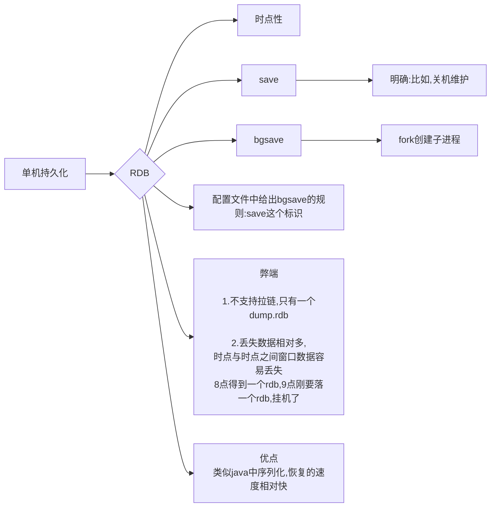
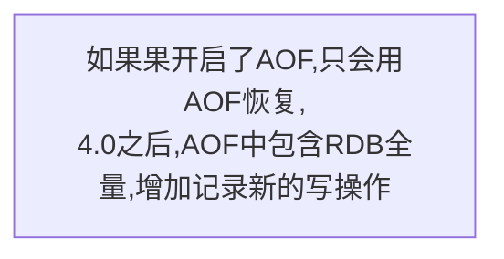
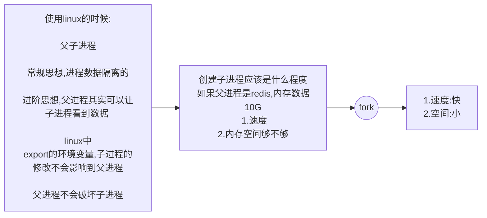
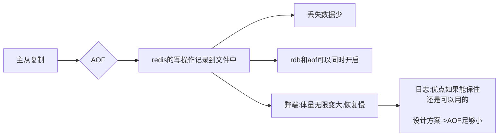
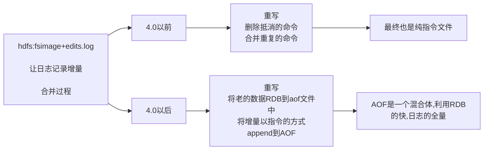
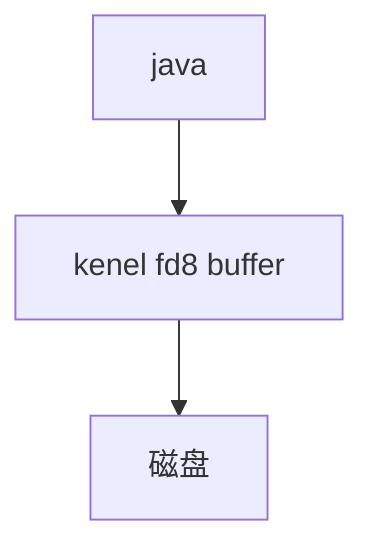

### 数据库设计

缓存:数据可以丢 急速!

数据库:数据绝对不能丢 速度+持久性 

掉电易失!

redis+mysql > 数据库 < 不太对

### redis如何持久化

存储层:

1.快照/副本

2.日志

#### 从linux进程开始聊





```
[lemcoden@hadoop01 ~]$ num=0
[lemcoden@hadoop01 ~]$ ((num++))
[lemcoden@hadoop01 ~]$ echo $num
1
[lemcoden@hadoop01 ~]$ ((num++)) | echo ok
ok
[lemcoden@hadoop01 ~]$ echo $num
1
```

#### 管道

1. 衔接,前一个命令的输出作为后一个命令的输入

2. 管道会触发子进程

```
[lemcoden@hadoop01 ~]$ num=0
[lemcoden@hadoop01 ~]$ ((num++))
[lemcoden@hadoop01 ~]$ echo $num
1
[lemcoden@hadoop01 ~]$ ((num++)) | echo ok
ok
[lemcoden@hadoop01 ~]$ echo $num
1
[lemcoden@hadoop01 ~]$ echo $$
2236
[lemcoden@hadoop01 ~]$ echo $$ | more
2236
[lemcoden@hadoop01 ~]$ echo $BASHPID
2236
[lemcoden@hadoop01 ~]$ echo $BASHPID | more
8130
[lemcoden@hadoop01 ~]$ echo $BASHPID | more
8132
[lemcoden@hadoop01 ~]$ echo $BASHPID | more
8134
[lemcoden@hadoop01 ~]$ echo $BASHPID | more
8136

```

#### 进程演示




```
[lemcoden@hadoop01 ~]$ echo $num

[lemcoden@hadoop01 ~]$ exit
exit
[lemcoden@hadoop01 ~]$ export num
[lemcoden@hadoop01 ~]$ /bin/bash
[lemcoden@hadoop01 ~]$ echo $num
1
```

test.sh

```
#!/bin/bash
echo $$
echo $num
num=999
echo num:$num

sleep 20

echo $num
```

执行状况(子进程不会修改父进程)

```
[lemcoden@hadoop01 ~]$ ./test.sh &
[1] 8558
[lemcoden@hadoop01 ~]$ 8558
1
num:999

[lemcoden@hadoop01 ~]$ echo $$
8454
[lemcoden@hadoop01 ~]$ 999
```

执行状况(父进程不会破坏子进程)

```
[lemcoden@hadoop01 ~]$ ./test.sh &
[1] 8623
[lemcoden@hadoop01 ~]$ 8623
1
num:999

[lemcoden@hadoop01 ~]$ echo $num
1
[lemcoden@hadoop01 ~]$ num=888
[lemcoden@hadoop01 ~]$ echo $num
888
[lemcoden@hadoop01 ~]$ 999
```

#### RDB

redis实现持久化需要解决两个问题:

1. 非阻塞,redis继续对外提供服务

2. 将数据落地

通过fork和copy on  write实现

时点.png

**RDB配置要点**

*****

```
######################## SNAPSHOTTING  ########################
#   save ""

save 900 1
save 300 10
save 60 10000

rdbcompression yes

rdbchecksum yes 文件末尾写入校验位

dbfilename dump.rdb

dir /var/lib/redis/6379
```

**为什么一般redis设置1到10个G,而不占满内存?**

因为做数据持久化的时候,磁盘IO的瓶颈,为了保证redis的速度,不能有太大的数据量做持久化.

#### AOF






redis运行了10年

开启了AOF

10年头,redis挂了

1. AOF多大:10T

   **恢复:会不会溢出**

2. 恢复要多久:恢复5年

**redis内存数据库**

原点:redis是内存数据库

写操作会触发IO

NO

aways

每秒




```
############################## APPEND ONLY MODE ###############################
appendonly yes
appendfilename "appendonly.aof
# appendfsync always
appendfsync everysec
# appendfsync no 等内核buffer快满了.kernel自动flush

no-appendfsync-on-rewrite no 
redis有一个正在进行rdb的子进程时,此值为true,就不会产生AOF写
???
# When rewriting the AOF file, Redis is able to use an RDB preamble in the
# AOF file for faster rewrites and recoveries. When this option is turned
# on the rewritten AOF file is composed of two different stanzas:
#
#   [RDB file][AOF tail]
#
# When loading Redis recognizes that the AOF file starts with the "REDIS"
# string and loads the prefixed RDB file, and continues loading the AOF
# tail.
aof-use-rdb-preamble yes
```

**AOF实操**

```
daemonize no
#logfile /var/log/redis_6379
aof-use-rdb-preamble no
[lemcoden@hadoop01 6379]$cd /var/lib/redis/6379
[lemcoden@hadoop01 6379]$rm -f dump.rdb
[lemcoden@hadoop01 6379]$ systemctl stop redis_6379
[lemcoden@hadoop01 6379]$ sudo ./redis-server /etc/redis/6379.conf 
[lemcoden@hadoop01 6379]$ redis-cli 
127.0.0.1:6379> set k1 hello
OK
[lemcoden@hadoop01 6379]$ vim appendonly.aof 
*2
$6
SELECT
$1
0
*3
$3
set
$2
k1
$5
hello
[lemcoden@hadoop01 6379]$ redis-cli 
127.0.0.1:6379> bgsave
[lemcoden@hadoop01 6379]$ redis-check-rdb  dump.rdb 
[offset 0] Checking RDB file dump.rdb
[offset 26] AUX FIELD redis-ver = '5.0.5'
[offset 40] AUX FIELD redis-bits = '64'
[offset 52] AUX FIELD ctime = '1605840860'
[offset 67] AUX FIELD used-mem = '853472'
[offset 83] AUX FIELD aof-preamble = '0'
[offset 85] Selecting DB ID 0
[offset 107] Checksum OK
[offset 107] \o/ RDB looks OK! \o/
[info] 1 keys read
[info] 0 expires
[info] 0 already expired
```

**重写AOF**

```
[lemcoden@hadoop01 6379]$ redis-cli 
127.0.0.1:6379> set k1 a
OK
127.0.0.1:6379> set k1 b
OK
127.0.0.1:6379>  set k1 c
OK
127.0.0.1:6379> get k1
"c"
127.0.0.1:6379> BGREWRITEAOF
[lemcoden@hadoop01 6379]$ vim appendonly.aof 
Backgrou*2
$6
SELECT
$1
0
*3
$3
SET
$2
k1
$1
c
```

**AOF & RDB混合**

```
aof-use-rdb-preamble yes
[lemcoden@hadoop01 6379]$ redis-cli 
127.0.0.1:6379> set k1 a
OK
127.0.0.1:6379> set k1 b
OK
127.0.0.1:6379>  set k1 c
OK
127.0.0.1:6379> get k1
"c"
127.0.0.1:6379> BGREWRITEAOF
[lemcoden@hadoop01 6379]$ vim appendonly.aof 
REDIS0009ú      redis-ver^E5.0.5ú
redis-bitsÀ@ú^EctimeÂK3·_ú^Hused-memÂÐ^E^M^@ú^Laof-preambleÀ^Aþ^@û^A^@^@^Bk1^Acÿ<84>^Q·<9e>^T"<96>]
~                     
```

```
# Automatic rewrite of the append only file.
# Redis is able to automatically rewrite the log file implicitly calling
# BGREWRITEAOF when the AOF log size grows by the specified percentage.
#
# This is how it works: Redis remembers the size of the AOF file after the
# latest rewrite (if no rewrite has happened since the restart, the size of
# the AOF at startup is used).
#
# This base size is compared to the current size. If the current size is
# bigger than the specified percentage, the rewrite is triggered. Also
# you need to specify a minimal size for the AOF file to be rewritten, this
# is useful to avoid rewriting the AOF file even if the percentage increase
# is reached but it is still pretty small.
#
# Specify a percentage of zero in order to disable the automatic AOF
# rewrite feature.

auto-aof-rewrite-percentage 100
auto-aof-rewrite-min-size 64mb

```

