#### AKF概述

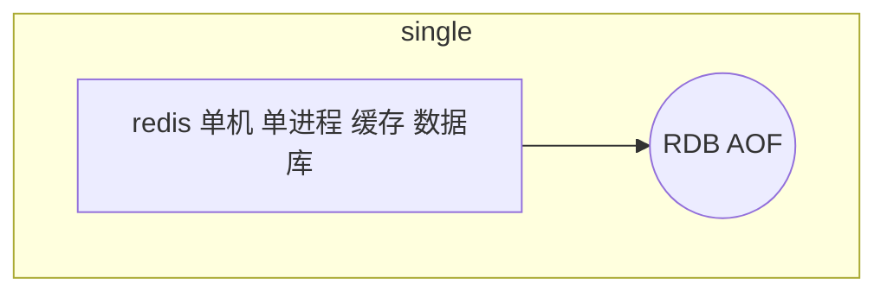

单机,单节点,单实例

1.单点故障

2.容量有限

3.压力

**AKF => xyz**

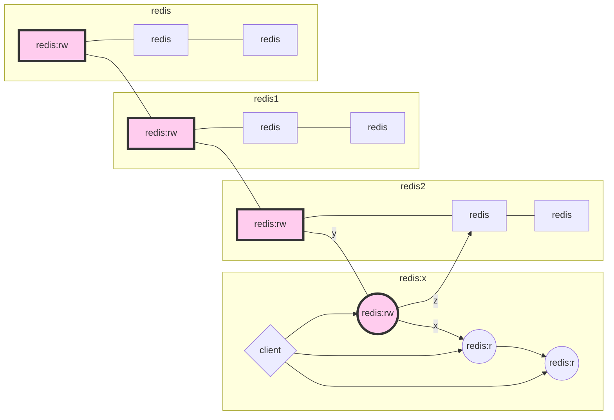

**AKF一变多**

数据一致性问题

所有节点阻塞直到数据全部一致

* 同步方式

强一致性

极其容易破坏可用性!反问自己:为什么一边多? 解决可用性

* 通过异步方式

容忍数据丢失一部分


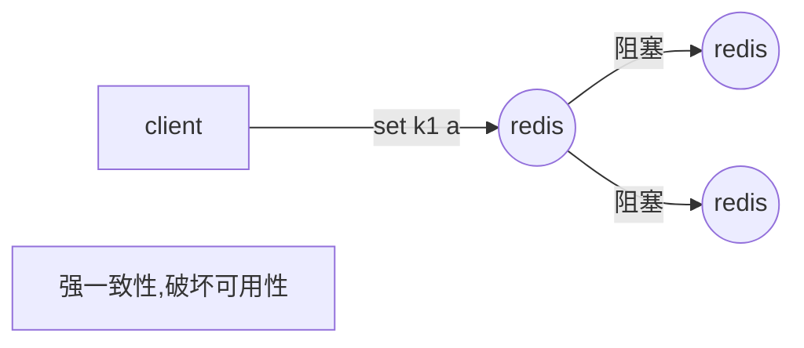

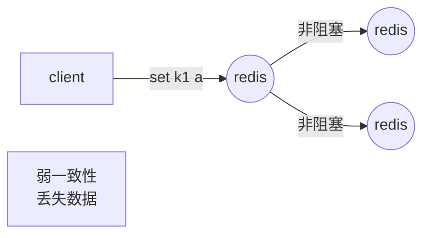


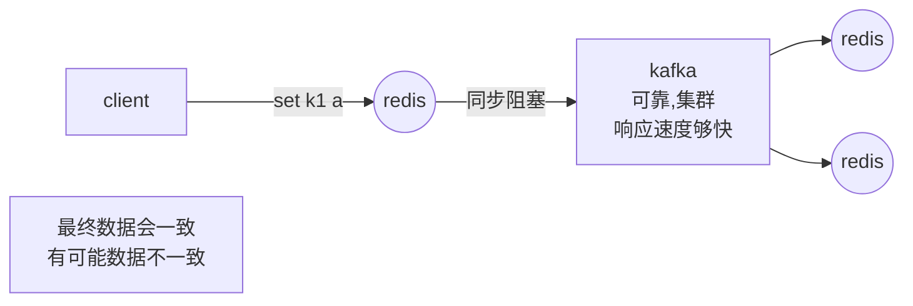


**主从:**

主从复制,主机有的数据从机也有

客户端主从都可以访问

**主备:**

客户端只访问master

备用机不参业务

**主机**

负责读写

自己又是一个:单点

**<center>一般对主做高可用,自动的故障转移:代替人</center>**

<center><i class="fa fa-long-arrow-down" aria-hidden="true"></i><center>

<center>人是怎么做监控的</center>

<center><i class="fa fa-long-arrow-down" aria-hidden="true"></i><center>

<center>由一个技术,程序实现<br/>只要是一个程序就会有单点故障的问题,一变多的集群</center>

<center><i class="fa fa-long-arrow-down" aria-hidden="true"></i><center>

<center>有一些不一样的地方</center>

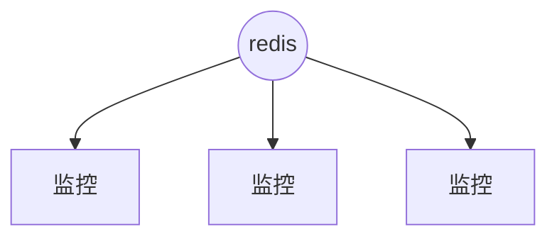

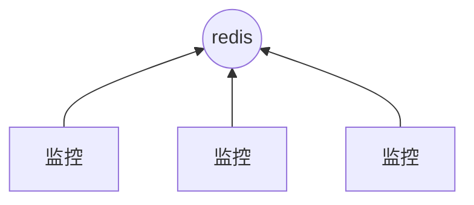

都给出 OK

强一致性


一部分给出OK

另一部分不算数

几个?

1,2


推导:

**1**台统计不准确,不够势力范围

问题:网络分区

脑裂


**2** 在3个节点成功解决脑裂问题

**3** 在4个节点成功解决脑裂问题

**4** 在5个节点成功解决脑裂问题

n/2+1 过半!

使用奇数台!

#### x实际操作:主从复制

启动安装redis-server脚本,6379,6380,6381

```
[lemcoden@hadoop01 utils]$ sudo ./install_server.sh 
Welcome to the redis service installer
This script will help you easily set up a running redis server

Please select the redis port for this instance: [6379] 6380
Please select the redis config file name [/etc/redis/6380.conf] 
Selected default - /etc/redis/6380.conf
Please select the redis log file name [/var/log/redis_6380.log] 
Selected default - /var/log/redis_6380.log
Please select the data directory for this instance [/var/lib/redis/6380] 
Selected default - /var/lib/redis/6380
Please select the redis executable path [] /opt/bigdata/module/redis5/bin/redis-server
Selected config:
Port           : 6380
Config file    : /etc/redis/6380.conf
Log file       : /var/log/redis_6380.log
Data dir       : /var/lib/redis/6380
Executable     : /opt/bigdata/module/redis5/bin/redis-server
Cli Executable : /opt/bigdata/module/redis5/bin/redis-cli
Is this ok? Then press ENTER to go on or Ctrl-C to abort.
Copied /tmp/6380.conf => /etc/init.d/redis_6380
Installing service...
Successfully added to chkconfig!
Successfully added to runlevels 345!
Starting Redis server...
Installation successful!
```

拷贝配置文件到测试目录

```
[lemcoden@hadoop01 test]$ cp /etc/redis/* ./
[lemcoden@hadoop01 test]$ ls
6379.conf  6380.conf  6381.conf
[lemcoden@hadoop01 test]$ vim 6379.conf 
daemonize no
#logfile /var/lib/redis/6379.log
appendonly no
```

启动redis-server

```
终端01
[lemcoden@hadoop01 bin]$ sudo ./redis-server /home/lemcoden/test/6379
终端02
[lemcoden@hadoop01 bin]$ sudo ./redis-server /home/lemcoden/test/6379
终端03
[lemcoden@hadoop01 bin]$ sudo ./redis-server /home/lemcoden/test/6379
```

启动redis-cli(略过)

REPLICAOF命令 降级主机slave

```
127.0.0.1:6380> REPLICAOF 127.0.0.1 6379
OK
```

```
127.0.0.1:6379> set k1 hello
OK


127.0.0.1:6380> get k1
"hello"
127.0.0.1:6380> set k1 222
(error) READONLY You can't write against a read only replica.

127.0.0.1:6381> set key2 ccc
OK
127.0.0.1:6381> get key2
"ccc"

127.0.0.1:6379> get key2 
(nil)

127.0.0.1:6381> REPLICAOF 127.0.0.1 6379
OK

127.0.0.1:6381> keys *
1) "k1"
```

kill 6381主机后,6379设置多个key,然后启动6381(增量同步)

```
127.0.0.1:6379> set k3 aaa
OK
127.0.0.1:6379> set k4 444
OK
127.0.0.1:6379> set k2 4123313
OK
127.0.0.1:6379> set k5 141jddpfipj
OK
127.0.0.1:6379> set k6 sada
OK


[lemcoden@hadoop01 bin]$ sudo ./redis-server /home/lemcoden/test/6381.conf  --replicaof 127.0.0.1 6379

127.0.0.1:6381> keys *
1) "k3"
2) "k5"
3) "k4"
4) "k1"
5) "k6"
6) "k2"

```

如果6381开启AOF ,则会产生RDB sync

!!!!**且RDB文件中不存在replicaID号**

```
[lemcoden@hadoop01 bin]$ sudo ./redis-server /home/lemcoden/test/6381.conf  --replicaof 127.0.0.1 6379 --appendonly yes
 16071:S 21 Nov 2020 05:05:29.820 * Full resync from master: d93b72c43fc1777195b07d7546baf1b34a92fb4f:12772
 16071:S 21 Nov 2020 05:05:29.870 * MASTER <-> REPLICA sync: receiving 240 bytes from master
16071:S 21 Nov 2020 05:05:29.870 * MASTER <-> REPLICA sync: Flushing old data
16071:S 21 Nov 2020 05:05:29.874 * MASTER <-> REPLICA sync: Loading DB in memory
16071:S 21 Nov 2020 05:05:29.874 * MASTER <-> REPLICA sync: Finished with success
16071:S 21 Nov 2020 05:05:29.919 * Background AOF rewrite terminated with success

[lemcoden@hadoop01 6381]$ vim dump.rdb 

```

假如Master宕掉,SLAVE升级为Master

```
127.0.0.1:6381> REPLICAOF no one 
OK
16192:M 21 Nov 2020 05:18:36.965 * MASTER MODE enabled
127.0.0.1:6380> REPLICAOF 127.0.0.1 6381
OK

```

关于主从架构,conf文件的一些配置

```
# replicaof <masterip> <masterport>
# masterauth <master-password>
如果redis刚启动,从Master复制数据期间,是否还支持本机old数据查询
replica-serve-stale-data yes
备机是否只支持查询
replica-read-only yes
是否直接使用网络复制
repl-diskless-sync no
增量复制文件大小,salve短时间下线情况发生时
# repl-backlog-size 1mb
最少几个replica写成功
# min-replicas-to-write 3
# min-replicas-max-lag 10
```

主从复制配置,需要人工维护主的故障问题

#### x实际操作:HA哨兵

新建哨兵conf文件

```
port 26379
sentinel monitor mymaster 127.0.0.1 6379 2
```

启动服务器,启动哨兵26379,26380,26381

```
[lemcoden@hadoop01 bin]$ sudo ./redis-server /home/lemcoden/test/26379.conf --sentinel
16806:X 21 Nov 2020 05:57:09.434 # +monitor master mymaster 127.0.0.1 6379 quorum 2
16806:X 21 Nov 2020 05:57:09.435 * +slave slave 127.0.0.1:6381 127.0.0.1 6381 @ mymaster 127.0.0.1 6379
16806:X 21 Nov 2020 05:57:09.442 * +slave slave 127.0.0.1:6380 127.0.0.1 6380 @ mymaster 127.0.0.1 6379
16806:X 21 Nov 2020 06:00:34.614 * +sentinel sentinel aea8334513cd9abf6b18c40262915bd337033350 127.0.0.1 26380 @ mymaster 127.0.0.1 6379
16806:X 21 Nov 2020 06:00:54.877 * +sentinel sentinel f95f1b3b18e56f7bda1bdf5e8b39baa9400cb3d3 127.0.0.1 26381 @ mymaster 127.0.0.1 6379
```

 退出6379,master,sentinal推演出新的leader,

```
16806:X 21 Nov 2020 06:04:32.642 * +failover-state-send-slaveof-noone slave 127.0.0.1:6380 127.0.0.1 6380 @ mymaster 127.0.0.1 6379
```

**sentinel通过发布订阅知道其他sentinel**

```
127.0.0.1:6380> PSUBSCRIBE *
Reading messages... (press Ctrl-C to quit)
1) "psubscribe"
2) "*"
3) (integer) 1
1) "pmessage"
2) "*"
3) "__sentinel__:hello"
4) "127.0.0.1,26380,aea8334513cd9abf6b18c40262915bd337033350,1,mymaster,127.0.0.1,6380,1"
1) "pmessage"
2) "*"
3) "__sentinel__:hello"
4) "127.0.0.1,26381,f95f1b3b18e56f7bda1bdf5e8b39baa9400cb3d3,1,mymaster,127.0.0.1,6380,1"
1) "pmessage"
2) "*"
```

sentinel 配置文件

```
$REDIS_SRC/sentinel.conf
port 26379
daemonize no
.....
```

#### y概述

单节点副本解决了单点故障和压力的问题,但是容量问题没有解决

容量client端解决方式

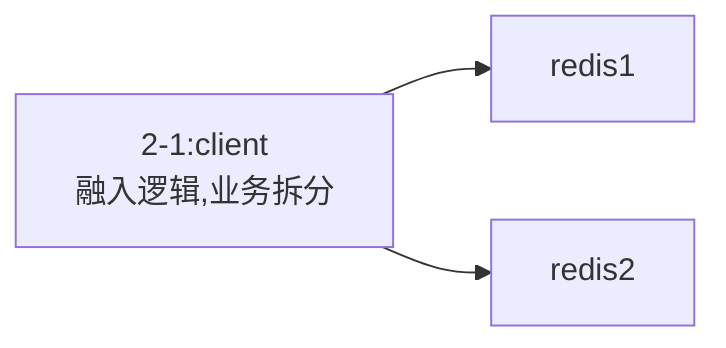

*sharding分片方式*

hash+取模

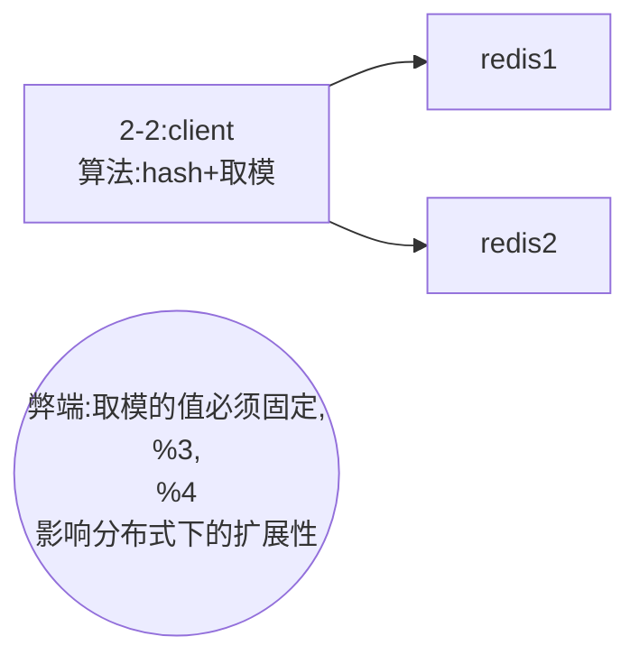

random lpush 适用于消息队列场景

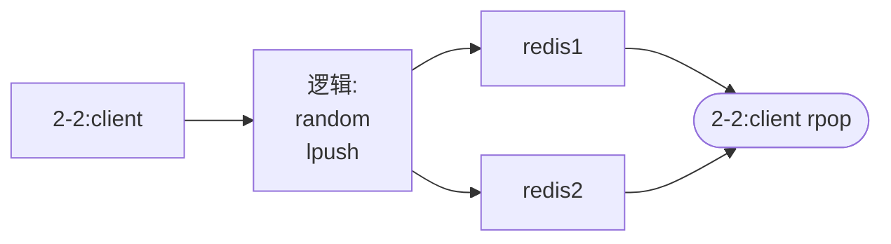

一致性hash算法

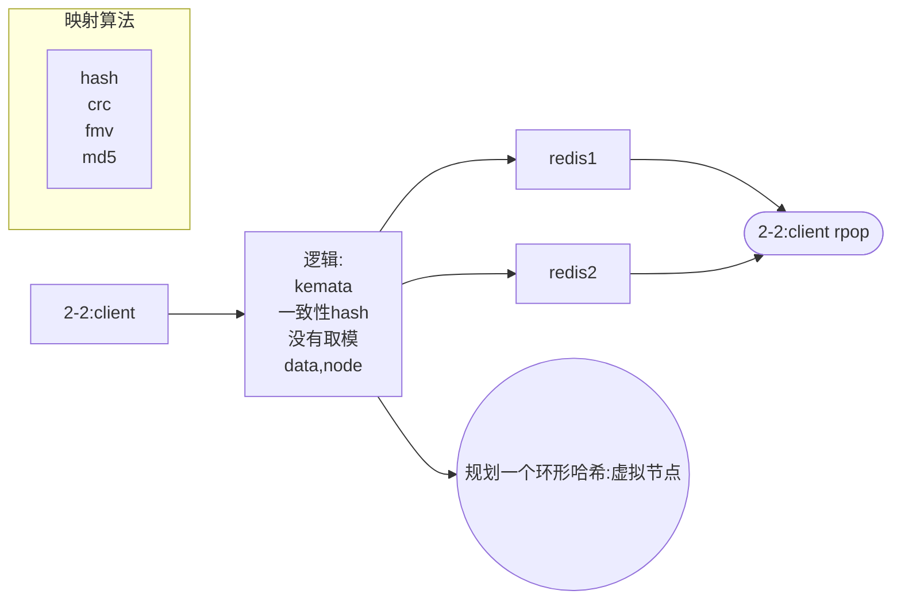

一致性Hash优点:

你加节点,的确可以分担其他节点的压力,不会造成全局洗牌

缺点:

新增节点造成一小部分数据不能命中

1.问题,缓存击穿,压到mysql

2.方案,每次取离我最近的2个物理节点


更倾向于作为缓存,而不是数据库


弊端:

3个模式不能做数据库用


预分区


#### twemproxy安装

大部分直接按照官网的README操作

编译完成之后,进入scrips目录

将nutcracker.init copy到/etc/ini.d目录下

```
[lemcoden@hadoop01 scripts]$ sudo cp nutcracker.init /etc/init.d/twemproxy
[lemcoden@hadoop01 init.d]$ sudo chmod +x twemproxy 
```

新建/etc/nutcracker/

将源码的config目录下的所有文件copy过来

```
[lemcoden@hadoop01 conf]$ sudo mkdir /etc/nutcracker/
[lemcoden@hadoop01 conf]$ ls
nutcracker.leaf.yml  nutcracker.root.yml  nutcracker.yml
[lemcoden@hadoop01 conf]$ cp ./* /etc/nutcracker/
```

将src文件夹下的nutcracker可执行文件copy到/usr/bin/目录下

```
[lemcoden@hadoop01 src]$ sudo cp nutcracker /usr/bin/
```

新建redis数据文件夹,

并手动启动redis-server

```
[lemcoden@hadoop01 nutcracker]$ cd ~
[lemcoden@hadoop01 ~]$ mkdir data
[lemcoden@hadoop01 ~]$ cd data/
[lemcoden@hadoop01 data]$ mkdir 6379
[lemcoden@hadoop01 data]$ mkdir 6380
[lemcoden@hadoop01 data]$ cd 6379
[lemcoden@hadoop01 6379]$ redis-server --port 6379
[lemcoden@hadoop01 data]$ cd 6380
[lemcoden@hadoop01 6379]$ redis-server --port 6380
启动twemproxy代理
[lemcoden@hadoop01 ~]$ systemctl start twemproxy
客户端链接代理
[lemcoden@hadoop01 ~]$ redis-cli -p 22121
127.0.0.1:22121> set k1 sss
(error) ERR Connection refused
127.0.0.1:22121> set k2 sss
(error) ERR Connection refused
127.0.0.1:22121> set k1 sss
OK
127.0.0.1:22121> set k2 sss
OK
127.0.0.1:22121> keys *
Error: Server closed the connection


[lemcoden@hadoop01 ~]$ redis-cli -p 6380
127.0.0.1:6380> keys * 
1) "k2"
2) "k1"
127.0.0.1:6380> keys *
1) "k3"
2) "k2"
3) "k1"
127.0.0.1:6380> keys *
1) "k3"
2) "k2"
3) "k4"
4) "k1"

[lemcoden@hadoop01 ~]$ redis-cli -p 6379
127.0.0.1:6379> keys *
(empty list or set)
127.0.0.1:6379> keys *
(empty list or set)
127.0.0.1:6379> keys *
(empty list or set)
127.0.0.1:22121> MULTI
Error: Server closed the connection
```

#### predixy 安装

上github,找到release包,下载下来,解压

```
wget https://github.com/joyieldInc/predixy/releases/download/1.0.5/predixy-1.0.5-bin-amd64-linux.tar.gz
```

```
修改conf文件
[lemcoden@hadoop01 conf]$ vim predixy.conf
#cluster.conf
Include sentinel.conf
#try.conf
```

```
修改conf文件
[lemcoden@hadoop01 conf]$ vim sentinel.conf
    Sentinels {
        + 127.0.0.1:26379
        + 127.0.0.1:26380
        + 127.0.0.1:26381
    }
    Group ooxx {
    }
    Group xxoo {
    }

```

**集群文件配置(sentinel)**

```
port 26379
sentinel monitor ooxx 127.0.0.1 36379 2
sentinel monitor xxoo 127.0.0.1 46379 2

port 26380
sentinel monitor ooxx 127.0.0.1 36379 2
sentinel monitor xxoo 127.0.0.1 46379 2

port 26381
sentinel monitor xxoo 127.0.0.1 46379 2
sentinel monitor ooxx 127.0.0.1 36379 2
```

**集群启动**

```
[lemcoden@hadoop01 test]$ redis-server 26379.conf --sentinel
[lemcoden@hadoop01 test]$ redis-server 26380.conf --sentinel
[lemcoden@hadoop01 test]$ redis-server 26381.conf --sentinel
[lemcoden@hadoop01 36379]$ redis-server  --port 36379
[lemcoden@hadoop01 36379]$ redis-server  --port 36380
[lemcoden@hadoop01 36379]$ redis-server  --port 46379
[lemcoden@hadoop01 36379]$ redis-server  --port 46380
[lemcoden@hadoop01 predixy-1.0.5]$ ./bin/predixy conf/predixy.conf 
```

**redis-cli实验**

```
[lemcoden@hadoop01 ~]$ redis-cli -p 7617
127.0.0.1:7617> set k1 sdfsdf
OK
127.0.0.1:7617> get k1"sdfsdf"
127.0.0.1:7617> set k2 sdfsdf
OK
127.0.0.1:7617> get k2
"sdfsdf"
127.0.0.1:7617> set {oo}k1 sdfsdfsdfs
OK
127.0.0.1:7617> set {oo}k2 sdasdasfasfqad
OK
127.0.0.1:7617> WATCH {oo}k1
(error) ERR forbid transaction in current server pool
127.0.0.1:7617> 
[lemcoden@hadoop01 ~]$ redis-cli -p  46379
127.0.0.1:46379> keys *
1) "k2"
127.0.0.1:46379> keys *
1) "{oo}k1"
2) "k2"
3) "{oo}k2"
127.0.0.1:46379> 
[lemcoden@hadoop01 ~]$ redis-cli  -p 36379
127.0.0.1:36379> keys *
1) "k1"
127.0.0.1:36379> keys *
1) "k1"
127.0.0.1:36379> 
```

**不支持事务,所以试验单主从**

修改config

```

```

```

127.0.0.1:7617> set k1 sdasfa
QUEUED
127.0.0.1:7617> set k2 asdada
QUEUED

127.0.0.1:36379> keys *
1) "k1"
2) "k2"

127.0.0.1:7617> MULTI
OK
127.0.0.1:7617> get k1 
QUEUED
127.0.0.1:7617> set k2 2222
QUEUED
127.0.0.1:7617> exec
1) "sdasfa"
2) OK
```

kill掉36379进程,哨兵会自动选择,在代理层是感觉不到的

```
kill掉36379进程之后
127.0.0.1:7617> get k1
"sdasfa"
```

#### redis官方集群样例

去redis源码的utils/create-cluster目录下:

```
[lemcoden@hadoop01 create-cluster]$ vim create-cluster 
[lemcoden@hadoop01 create-cluster]$ ./create-cluster start
Starting 30001
Starting 30002
Starting 30003
Starting 30004
Starting 30005
Starting 30006
[lemcoden@hadoop01 create-cluster]$ ./create-cluster create
>>> Performing hash slots allocation on 6 nodes...
Master[0] -> Slots 0 - 5460
Master[1] -> Slots 5461 - 10922
Master[2] -> Slots 10923 - 16383
Adding replica 127.0.0.1:30005 to 127.0.0.1:30001
Adding replica 127.0.0.1:30006 to 127.0.0.1:30002
Adding replica 127.0.0.1:30004 to 127.0.0.1:30003
>>> Trying to optimize slaves allocation for anti-affinity
[WARNING] Some slaves are in the same host as their master
M: a403574ce40177866a188d16a615848bd5b5459a 127.0.0.1:30001
   slots:[0-5460] (5461 slots) master
M: 638ac8a174e8a66b1e46bb19155860a5c3aa415b 127.0.0.1:30002
   slots:[5461-10922] (5462 slots) master
M: 6a2c3dd007e7d44c95c51d33002e9cc0fdc429ba 127.0.0.1:30003
   slots:[10923-16383] (5461 slots) master
S: 69313ced470329f55a5bdf408e4285f345a24154 127.0.0.1:30004
   replicates 6a2c3dd007e7d44c95c51d33002e9cc0fdc429ba
S: 967818092ca216fe22a90160587fbdbfc23dd70b 127.0.0.1:30005
   replicates a403574ce40177866a188d16a615848bd5b5459a
S: 00e70c8bebff2e59e89ed3e1e152d6805ad36eff 127.0.0.1:30006
   replicates 638ac8a174e8a66b1e46bb19155860a5c3aa415b
Can I set the above configuration? (type 'yes' to accept): 
>>> Nodes configuration updated
>>> Assign a different config epoch to each node
>>> Sending CLUSTER MEET messages to join the cluster
Waiting for the cluster to join
..
>>> Performing Cluster Check (using node 127.0.0.1:30001)
M: a403574ce40177866a188d16a615848bd5b5459a 127.0.0.1:30001
   slots:[0-5460] (5461 slots) master
   1 additional replica(s)
S: 967818092ca216fe22a90160587fbdbfc23dd70b 127.0.0.1:30005
   slots: (0 slots) slave
   replicates a403574ce40177866a188d16a615848bd5b5459a
S: 00e70c8bebff2e59e89ed3e1e152d6805ad36eff 127.0.0.1:30006
   slots: (0 slots) slave
   replicates 638ac8a174e8a66b1e46bb19155860a5c3aa415b
S: 69313ced470329f55a5bdf408e4285f345a24154 127.0.0.1:30004
   slots: (0 slots) slave
   replicates 6a2c3dd007e7d44c95c51d33002e9cc0fdc429ba
M: 638ac8a174e8a66b1e46bb19155860a5c3aa415b 127.0.0.1:30002
   slots:[5461-10922] (5462 slots) master
   1 additional replica(s)
M: 6a2c3dd007e7d44c95c51d33002e9cc0fdc429ba 127.0.0.1:30003
   slots:[10923-16383] (5461 slots) master
   1 additional replica(s)
[OK] All nodes agree about slots configuration.
>>> Check for open slots...
>>> Check slots coverage...
[OK] All 16384 slots covered.


客户端
[lemcoden@hadoop01 create-cluster]$ redis-cli -p 30001
127.0.0.1:30001> set k1 sdfsdf
(error) MOVED 12706 127.0.0.1:30003
127.0.0.1:30001> 
[lemcoden@hadoop01 create-cluster]$ redis-cli -p 30001
127.0.0.1:30001> set k1 sdfsdf
(error) MOVED 12706 127.0.0.1:30003
127.0.0.1:30001> 
[lemcoden@hadoop01 create-cluster]$ redis-cli -c  -p 30001 (cluster集群模式)
127.0.0.1:30001> set k1 sdfsdf
-> Redirected to slot [12706] located at 127.0.0.1:30003
OK
127.0.0.1:30003> get k1
"sdfsdf"
127.0.0.1:30003> set k2 sdfsdsf
-> Redirected to slot [449] located at 127.0.0.1:30001
OK
127.0.0.1:30001> get k2
"sdfsdsf"
127.0.0.1:30001> get k1
-> Redirected to slot [12706] located at 127.0.0.1:30003
"sdfsdf"
127.0.0.1:30003> WATCH k2
-> Redirected to slot [449] located at 127.0.0.1:30001
OK
127.0.0.1:30001> MULTI
OK
127.0.0.1:30001> set k1 232323456
-> Redirected to slot [12706] located at 127.0.0.1:30003
OK
127.0.0.1:30003> set sdfsdf sdfsdf
OK
127.0.0.1:30003> exec
(error) ERR EXEC without MULTI 
(事务中重定向不同的进程的命令会失败)

127.0.0.1:30003> set {oo}k1 sdfsdf
-> Redirected to slot [1629] located at 127.0.0.1:30001
OK
127.0.0.1:30001> set {oo}k2 sdfsdf
OK
127.0.0.1:30001> set {oo}k3 sdfsdf
OK
127.0.0.1:30001> WATCH {oo}k1
OK
127.0.0.1:30001> MULTI
OK
127.0.0.1:30001> set {oo}k2 234234
QUEUED
127.0.0.1:30001> get  {oo}k3
QUEUED
127.0.0.1:30001> exec
1) OK
2) "sdfsdf"
(可以在事务中给key添加相同的前缀)
```

#### 客户端分赃

```
[lemcoden@hadoop01 create-cluster]$ ./create-cluster start
[lemcoden@hadoop01 create-cluster]$ redis-cli --cluster create 127.0.0.1:30001 127.0.0.1:30002 127.0.0.1:30003 127.0.0.1:30004 127.0.0.1:30005 127.0.0.1:30006 --cluster-replicas 1
```

客户端重新分片

```
[lemcoden@hadoop01 create-cluster]$ redis-cli --cluster reshard 127.0.0.1:30001
>>> Performing Cluster Check (using node 127.0.0.1:30001)
M: 8271c8dcb899de726fe6c6ffe0ebcdb9a494eb0a 127.0.0.1:30001
   slots:[0-5460] (5461 slots) master
   1 additional replica(s)
S: c41870d1a555d7674b8a13f2e52cfd926113fd1e 127.0.0.1:30004
   slots: (0 slots) slave
   replicates 0d0f70ad6b408f7c56897450eb605aa9e95e10ab
M: 0d0f70ad6b408f7c56897450eb605aa9e95e10ab 127.0.0.1:30002
   slots:[5461-10922] (5462 slots) master
   1 additional replica(s)
M: 55c02c59f51913c654087fbf0ab2e8ee2464d017 127.0.0.1:30003
   slots:[10923-16383] (5461 slots) master
   1 additional replica(s)
S: 8ccf40a81064e64afb56999dbd931636e7b49519 127.0.0.1:30005
   slots: (0 slots) slave
   replicates 55c02c59f51913c654087fbf0ab2e8ee2464d017
S: 85aa8ac690ba144599e7fb47b733d22dc365c036 127.0.0.1:30006
   slots: (0 slots) slave
   replicates 8271c8dcb899de726fe6c6ffe0ebcdb9a494eb0a
[OK] All nodes agree about slots configuration.
>>> Check for open slots...
>>> Check slots coverage...
[OK] All 16384 slots covered.
How many slots do you want to move (from 1 to 16384)? 2000
What is the receiving node ID? 0d0f70ad6b408f7c56897450eb605aa9e95e10ab
Please enter all the source node IDs.
  Type 'all' to use all the nodes as source nodes for the hash slots.
  Type 'done' once you entered all the source nodes IDs.
Source node #1: 8271c8dcb899de726fe6c6ffe0ebcdb9a494eb0a
Source node #2: done

检查使用info或者check命令
[lemcoden@hadoop01 ~]$ redis-cli --cluster info 127.0.0.1:30001
127.0.0.1:30001 (8271c8dc...) -> 0 keys | 3461 slots | 1 slaves.
127.0.0.1:30002 (0d0f70ad...) -> 0 keys | 7462 slots | 1 slaves.
127.0.0.1:30003 (55c02c59...) -> 0 keys | 5461 slots | 1 slaves.
[OK] 0 keys in 3 masters.
0.00 keys per slot on average.

[lemcoden@hadoop01 ~]$ redis-cli --cluster check 127.0.0.1:30001
127.0.0.1:30001 (8271c8dc...) -> 0 keys | 3461 slots | 1 slaves.
127.0.0.1:30002 (0d0f70ad...) -> 0 keys | 7462 slots | 1 slaves.
127.0.0.1:30003 (55c02c59...) -> 0 keys | 5461 slots | 1 slaves.
[OK] 0 keys in 3 masters.
0.00 keys per slot on average.
>>> Performing Cluster Check (using node 127.0.0.1:30001)
M: 8271c8dcb899de726fe6c6ffe0ebcdb9a494eb0a 127.0.0.1:30001
   slots:[2000-5460] (3461 slots) master
   1 additional replica(s)
S: c41870d1a555d7674b8a13f2e52cfd926113fd1e 127.0.0.1:30004
   slots: (0 slots) slave
   replicates 0d0f70ad6b408f7c56897450eb605aa9e95e10ab
M: 0d0f70ad6b408f7c56897450eb605aa9e95e10ab 127.0.0.1:30002
   slots:[0-1999],[5461-10922] (7462 slots) master
   1 additional replica(s)
M: 55c02c59f51913c654087fbf0ab2e8ee2464d017 127.0.0.1:30003
   slots:[10923-16383] (5461 slots) master
   1 additional replica(s)
S: 8ccf40a81064e64afb56999dbd931636e7b49519 127.0.0.1:30005
   slots: (0 slots) slave
   replicates 55c02c59f51913c654087fbf0ab2e8ee2464d017
S: 85aa8ac690ba144599e7fb47b733d22dc365c036 127.0.0.1:30006
   slots: (0 slots) slave
   replicates 8271c8dcb899de726fe6c6ffe0ebcdb9a494eb0a
[OK] All nodes agree about slots configuration.
>>> Check for open slots...
>>> Check slots coverage...
[OK] All 16384 slots covered.


```


<head> 
    <script defer src="https://use.fontawesome.com/releases/v5.0.13/js/all.js"></script> 
    <script defer src="https://use.fontawesome.com/releases/v5.0.13/js/v4-shims.js"></script> 
</head> 

<link rel="stylesheet" href="https://use.fontawesome.com/releases/v5.0.13/css/all.css">