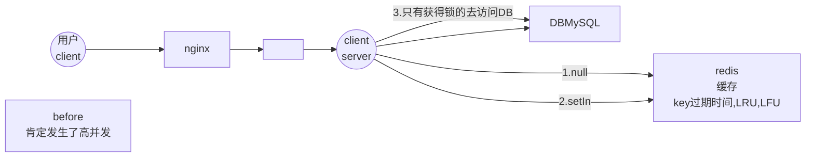
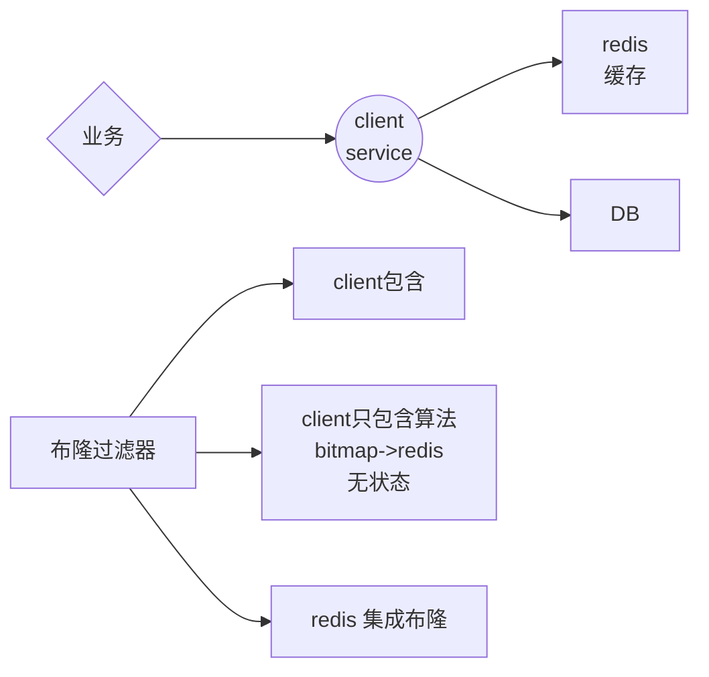
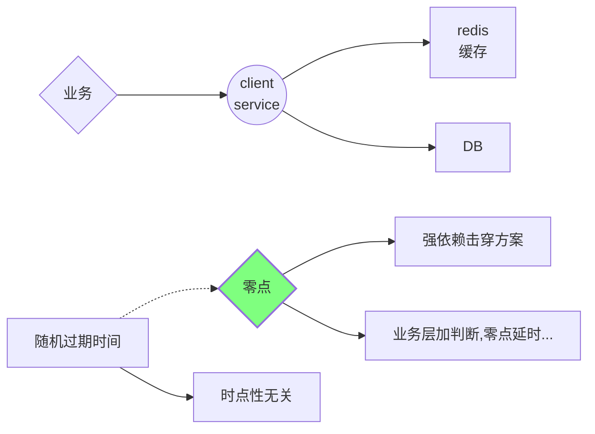

### redis常见问题

```
jedis,luttce,springboot:low/high level
```

#### 击穿

**<font color=MediumVioletRed>key过期造成并发访问数据库</font>**



解决:

并发有了:阻止并发到达DB,redis又没有key

redis是单进程单实例

setInx() -> 锁

<!--more-->

setInx() -> 锁

1.get key

2.setInx

3-1. ok ,去DB

3-2.false,sleep -> 1


问题:

1. 如果第一个人挂了?发生死锁

   可以设置锁的过期时间

2. 没挂,但是,锁超时了.....

   多线程,一个线程取库,一个线程监控,并延长时间

**自己实现分布式协调很麻烦**

#### 穿透

**<font color=MediumVioletRed>从业务接受查询的是你系统根本不存在的数据</font>**



bloom过滤器问题:

- [x] 只能增加,不能删除

- [x] 布谷鸟过滤器

- [ ] 空key

#### 雪崩

**<font color=MediumVioletRed>大量的key同时失效,间接的造成大量的访问到达DB</font>**



#### 分布式锁

1setnx

2.过期时间

3.多线程(守护线程)延长过期


redisson

zookeeper 做分布式锁!

### API


```
127.0.0.1:6379> CONFIG GET *
127.0.0.1:6379> CONFIG SET protected-mode no
OK
```

