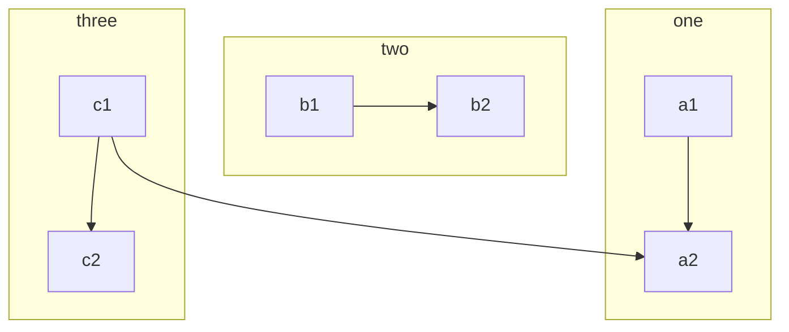

### mermaid 流程图

格式:

```
mermaid
	graph 流程图方向
	流程图内容
```

<!--more-->

#### 方向

- TB 从上到下
- BT 从下到上
- RL 从右到左
- LR 从左到右
- TD 同TB


#### 基本图形:

- id + [文字描述]矩形
- id + (文字描述)圆角矩形
- id + >文字描述]不对称的矩形
- id + {文字描述}菱形
- id + ((文字描述))圆形

#### 节点之间链接

A --> B     A带箭头指向B

A --- B      A不带箭头指向B

A -.- B      A用虚线指向B

A -.-> B    A用带箭头的虚线指向B

A ==> B   A用加粗的箭头指向B

A -- 描述 --- B       A不带箭头指向B并在中间加上文字描述

A -- 描述 --> B      A带箭头指向B并在中间加上文字描述

A -. 描述 .-> B      A用带箭头的虚线指向B并在中间加上文字描述

A == 描述 ==> B  A用加粗的箭头指向B并在中间加上文字描述

#### 子流程图

```
subgraph title
    graph definition
end
```

示例:

```
mermaid
graph TB
    c1-->a2
    subgraph one
    a1-->a2
    end
    subgraph two
    b1-->b2
    end
    subgraph three
    c1-->c2
    end
```




#### 自定义样式

语法：style id 具体样式

示例:

```memaid
mermaid
graph LR
    id1(Start)-->id2(Stop)
    style id1 fill:#f9f,stroke:#333,stroke-width:4px,fill-opacity:0.5
    style id2 fill:#ccf,stroke:#f66,stroke-width:2px,stroke-dasharray: 10,5
```


### 文字加粗,斜体

```
**文字加粗**
```

样例:

**文字加粗**

```
*斜体*
```

样例:

*斜体*

### 文字局中

```
<center>文字居中</center>
```

<center>文字居中</center>

### 使用font awesome

在文档末尾加入如下几句(具体版本可以直接去官网查询)

```
<head> 
    <script defer src="https://use.fontawesome.com/releases/v5.0.13/js/all.js"></script> 
    <script defer src="https://use.fontawesome.com/releases/v5.0.13/js/v4-shims.js"></script> 
</head> 
<link rel="stylesheet" href="https://use.fontawesome.com/releases/v5.0.13/css/all.css">
```

具体使用如下

```
<i class="fa fa-address-book" aria-hidden="true"></i>
```

样式:<center><i class="fa fa-address-book" aria-hidden="true"></i></center>

<head> 
    <script defer src="https://use.fontawesome.com/releases/v5.0.13/js/all.js"></script> 
    <script defer src="https://use.fontawesome.com/releases/v5.0.13/js/v4-shims.js"></script> 
</head> 
<link rel="stylesheet" href="https://use.fontawesome.com/releases/v5.0.13/css/all.css">

### 多选框

```
关于hadoop集群下列说法错误的是?
- [x] namenode负责数据的传输
- [x] hdfs副本放置策略优先副本放置到不同机架
- [ ] mapreduce的map分片大小的计算依赖于文件块大小
```

关于hadoop集群下列说法错误的是?
- [x] namenode负责数据的传输
- [x] hdfs副本放置策略优先副本放置到不同机架
- [ ] mapreduce的map分片大小的计算依赖于文件块大小