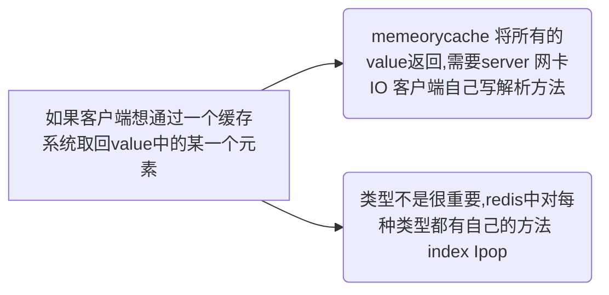
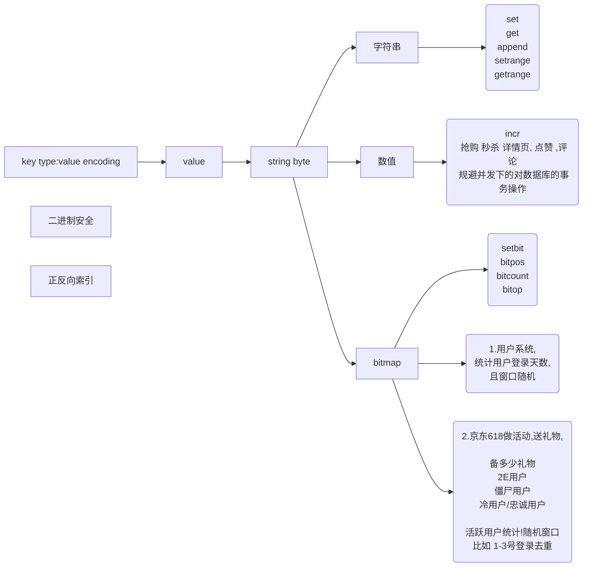

### 发展历程

数据库:表很大,性能下降?
	如果表有索引,增删改变慢(需要维护索引)
	查询速度会不会变慢:
		1.一个或少量查询依然很快
		2.并发大的时候会受硬盘带宽影响速度

<!--more-->

#### 硬盘数据库 vs 内存数据库

ps:SAP HANA 数据库:内存级别的关系型数据库 2T


数据在内存和磁盘体积不一样

磁盘没有指针概念 索引与数据本身冗余 数据胀出

?内存存储更少

内存级买不起,磁盘特别慢?  


2个基础设施:1.冯诺伊曼体系的硬件2.以太网,tcp/ip的网络 (限制原因)


折衷方案缓存 (redis memorycache)

 

http://db-engines.com - 数据库引擎排名网站

​				注意点: 分类 - ---关系型 ,key-value........

​							细节:systems-redies-分区方式,支持系统,,支持语言,分布式,冗余方式:主从复制,事务,一致性支持程度						不要破坏数据库本身特征


1.5M ops/sec 可以达到秒级十万操作

一般数据库 : 千级别

redis的介绍:引用自官网

Redis 是一个开源（BSD许可）的，内存中的数据结构存储系统，它可以用作数据库、缓存和消息中间件。 它支持多种<font color='#00ff00'>value类型</font>的数据结构，如 <font color='#00ff00'>字符串（strings）， 散列（hashes）， 列表（lists）， 集合（sets）， 有序集合（sorted sets） 与范围查询， bitmaps， hyperloglogs 和 地理空间（geospatial）</font> 索引半径查询。 Redis 内置了 复制（replication），LUA脚本（Lua scripting）， LRU驱动事件（LRU eviction），事务（transactions） 和不同级别的 磁盘持久化（persistence）， 并通过 Redis哨兵（Sentinel）和自动 分区（Cluster）提供高可用性（high availability）。

memcahed 为什么被取代

​			

value 没有类型的概念

json:表示很复杂的数据

世界上有三种数据表示

k = a k  = 1

k = [1,2,3] k = [a,x,f]

k=(x=y) k = [{},{}]




### 安装redis

#### 下载

```
wget http://download.redis.io/releases/redis-6.0.6.tar.gz
tar xzf redis-6.0.6.tar.gz
cd redis-6.0.6
```

#### 编译安装

阅读README

```
make
```

如果编译失败运行一下 make distclean

企业还需要 make test 测试一下编译流程

安装(实际就是将可执行程序迁入目标目录)

```
make install PREFIX = /opt/bigdata/module/redis5
```

配置环境变量,REDIS_HOME=/opt/bigdata/module/redis5

#### redis 服务化

安装包内服务:

进入到解压后的 `src` 目录，通过如下命令启动Redis:

```
 src/redis-server
```

服务常驻化:

进入redis的

在utils文件夹里面有install_server执行

```
Please select the redis port for this instance: [6379] 
Please select the redis config file name [/etc/redis/6379.conf] 
Please select the redis log file name [/var/log/redis_6379.log] 
Please select the data directory for this instance [/var/lib/redis/6379]
Please select the redis executable path [] 
```

```
Installing service...
Successfully added to chkconfig!
Successfully added to runlevels 345!
Starting Redis server...
Installation successful!
```

验证

```
ps -fe | grep redis

root      9726     1  0 21:40 ?        00:00:04 /opt/bigdata/module/redis5/bin/redis-server 127.0.0.1:6379

su root 

cd /proc/9726/fd

lrwx------. 1 root root 64 11月 14 22:10 0 -> /dev/null
lrwx------. 1 root root 64 11月 14 22:10 1 -> /dev/null
lrwx------. 1 root root 64 11月 14 22:10 2 -> /dev/null
lr-x------. 1 root root 64 11月 14 22:10 3 -> pipe:[45538]
l-wx------. 1 root root 64 11月 14 22:10 4 -> pipe:[45538]
lrwx------. 1 root root 64 11月 14 22:10 5 -> anon_inode:[eventpoll]
lrwx------. 1 root root 64 11月 14 22:10 6 -> socket:[45541]
```

#### 原理

闲篇:内存是线性地址空间,虚拟地址MMU

?????多线程切换有开销,但是在数据一致性面前代价是值得的

mysql是BIO,多个请求来的时候,IO总线会阻塞

mysql也会缓存数据,好像逼近redis性能

缓存内存空间的占用返而减缓mysql的处理sql的速度


一个redis服务是一个单进程 提供一个线程处理请求,redis通过epoll 获取数据

(每连接内命令"顺序"的)

> JVM:一个线程的成本:1MB

> > 1.线程多了调度成本CPU浪费(寄存器,高速缓存,内存用户态数据保存)

> > 2.内存成本

BIO

client 没收到 阻塞,其他线程收到时,kernel也不会返回, 同步阻塞时期


NIO

kernel 返回fd可判断是否有数据 同步非阻塞时期

轮训发生在用户空间 

如果有1000fd 代表用户进程轮询调用1000次kernel 成本问题


kenel增加一个系统调用 select,select 返回所有fd,让用户程序去轮询(多路复用NIO)

,减少用户内核态用户态切换


调用kernel 的create方法返回epfd,epoll会准备一个mmap,维护一个红黑树,所有链接注册到红黑树

????用户会调用(ctl add del socketfd),wait(),epoll等待

通过mmap系统调用共享空间.直接把fd放到共享空间当中(fd)


man 可以看八种类型的文档 

系统调用 为 二类文档

```
man 2 socket
man 2 select 
man 2 epoll
```


```
yum install man man-pages
socket
fd nonblock
```

零拷贝 调用内核sendfile方法 


### Clinet端的使用

```
redis-cli
	-h<host>
	-p<port>
	-a<password>
	-n<db>
```

redis默认的16个库

​									命令  表名:key value

```
127.0.0.1:6379> set k380:1 hello
OK
127.0.0.1:6379> get k380:1
"hello"
127.0.0.1:6379> select 8
OK
127.0.0.1:6379[8]> get k380:1
(nil)
127.0.0.1:6379[8]> 
```

help,按tab键补全

```
help @<group>
help <command>
help <tab>
```

```
keys
flushdb 清库不常用 一般企业别名
```

#### string类型&bitmap类型



```
127.0.0.1:6379> set k1 hello
OK
127.0.0.1:6379> get k1 
"hello"
127.0.0.1:6379> help set

  SET key value [expiration EX seconds|PX milliseconds] [NX|XX]
  summary: Set the string value of a key
  since: 1.0.0
  group: string

127.0.0.1:6379> set k1 ooxx nx  \\nx如果存在,不插入 分布式锁的时候使用
(nil)
127.0.0.1:6379> get k1
"hello"
127.0.0.1:6379> set k2 hello xx \\xx只能更新
(nil)
127.0.0.1:6379> get k2
(nil)


127.0.0.1:6379> mset k3 a k4 b
OK
127.0.0.1:6379> get k3 
"a"
127.0.0.1:6379> get k4 
"b"
127.0.0.1:6379> mget k3 k4
1) "a"
2) "b"


127.0.0.1:6379> get k1
"hello"
127.0.0.1:6379> append k1 " world"
(integer) 11
127.0.0.1:6379> get k1
"hello world"
```

```
127.0.0.1:6379> getrange k1 6 10
"world
127.0.0.1:6379> getrange k1 6 -1
"world"
127.0.0.1:6379> setrange k1 6 mashibing
(integer) 15
127.0.0.1:6379> get k1 
"hello mashibing"
127.0.0.1:6379> STRLEN k1
(integer) 15
127.0.0.1:6379> get k1
"hello mashibing"
```

type

```
127.0.0.1:6379> type k1
string
127.0.0.1:6379> set k2 hello
OK
127.0.0.1:6379> type k2 
string
127.0.0.1:6379> object help
1) OBJECT <subcommand> arg arg ... arg. Subcommands are:
2) ENCODING <key> -- Return the kind of internal representation used in order to store the value associated with a key.
3) FREQ <key> -- Return the access frequency index of the key. The returned integer is proportional to the logarithm of the recent access frequency of the key.
4) IDLETIME <key> -- Return the idle time of the key, that is the approximated number of seconds elapsed since the last access to the key.
5) REFCOUNT <key> -- Return the number of references of the value associated with the specified key.
127.0.0.1:6379> object encoding k2
"embstr"
127.0.0.1:6379> get k2
"hello"
127.0.0.1:6379> object encoding k1
"int"
127.0.0.1:6379> incr k1
(integer) 100
127.0.0.1:6379> incrby k1 22
(integer) 122
127.0.0.1:6379> get k1
"122"
127.0.0.1:6379> decr k1
(integer) 121
127.0.0.1:6379> decrby k1 22
(integer) 99
127.0.0.1:6379> incrbyfloat k1 0.5
"99.5"
127.0.0.1:6379> get k1
"99.5"
127.0.0.1:6379> set k3 jjjjjjjjjjjjjjjjjjjjjjjjjjjjjjjjjjjjjjjj
OK
127.0.0.1:6379> object encoding k3
"embstr"
127.0.0.1:6379> append k3 jjjjj
(integer) 45
127.0.0.1:6379> object encoding k3
"raw"


127.0.0.1:6379> FLUSHALL
OK
127.0.0.1:6379> set k1 hello
OK
127.0.0.1:6379> STRLEN k1
(integer) 5
127.0.0.1:6379> set k2 9
OK
127.0.0.1:6379> OBJECT encoding k2
"int"
127.0.0.1:6379> STRLEN k2
(integer) 1
127.0.0.1:6379> APPEND k2 999
(integer) 4
127.0.0.1:6379> get k2 
"9999"
127.0.0.1:6379> object encoding k2
"raw"
127.0.0.1:6379> INCR k2 
(integer) 10000
127.0.0.1:6379> OBJECT encoding k2
"int"
127.0.0.1:6379> STRLEN k2
(integer) 5
127.0.0.1:6379> set k3 a
OK
127.0.0.1:6379> get k3 
"a"
127.0.0.1:6379> STRLEN k3
(integer) 1
127.0.0.1:6379> APPEND k3 中
(integer) 4
127.0.0.1:6379> STRLEN k3
(integer) 4

```

#### redis只拿字节流,数据不会被破坏

如果是字符流,各个客户端对数据宽度的理解是不一样的,宽度不一致可能导致溢出问题

```
127.0.0.1:6379> set k1 99999
OK
127.0.0.1:6379> STRLEN k1
(integer) 5
```

即使是int值,redis也是编码成字节,如果对其调用INCR方法,它会先把字节转换成int值,

再进行INCR,如果incr成功了,然后再将其encoding成int

```
127.0.0.1:6379> set k2 中
OK
127.0.0.1:6379> STRLEN k2
(integer) 3
```

终端与redis的编码类型是UTF-8

如果改成GBK会变成2了

```
127.0.0.1:6379> get k2
"\xe4\xb8\xad"
```

```
[lemcoden@hadoop01 ~]$ redis-cli --raw
127.0.0.1:6379> get k3
涓
127.0.0.1:6379> get k2
中
```

--raw 编码集的格式化,默认utf-8

和Hbase一样是二进制安全的

**!!一定要沟通好数据的编码和解码**


成本问题

get和set是两个请求,getset减少一次IO通信

```
127.0.0.1:6379> set k1 hello
OK
127.0.0.1:6379> get k1
hello
127.0.0.1:6379> GETSET k1 mashbing
hello
127.0.0.1:6379> get k1
mashbing
```

原子性的操作

```
127.0.0.1:6379> MSETNX k1 a k2 b
1
127.0.0.1:6379> mget k1 k2
a
b
127.0.0.1:6379> MSETNX k2 c k3 d
0
127.0.0.1:6379> mget k1 k2 k3
a
b

```

面向字节有索引

面向二进制位也有索引

字符集 ascii

其他一般叫做扩展字符集,

其他字符集不再对ascii重编码

自己写一个程序,字节流读取,每字节判断

0开头,直接ASCII

1开头,看开头有几个1,有几个1读几个字节编码成扩展字符集

11100000

```
127.0.0.1:6379> setbit k1 1 1
(integer) 1
127.0.0.1:6379> STRLEN k1
(integer) 1
127.0.0.1:6379> GET k1
@
127.0.0.1:6379> setbit k1 7 1
(integer) 1
127.0.0.1:6379> STRLEN k1
(integer) 1
127.0.0.1:6379> get k1
A
127.0.0.1:6379> set k1 9 1
(error) ERR syntax error
127.0.0.1:6379> setbit k1 9 1
(integer) 0
127.0.0.1:6379> get k1
A@
```

?bitpos  寻找二进制位第一次出现的位置

```
127.0.0.1:6379> help bitpos
 BITPOS key bit [start] [end]
  summary: Find first bit set or clear in a string
  since: 2.8.7
  group: string
127.0.0.1:6379> bitpos k1 1 0 0
(integer) 1
127.0.0.1:6379> bitpos k1 1 1 1
(integer) 9
127.0.0.1:6379> bitpos k1 1 0 1
(integer) 1
```

bitcount 统计bit出现几次

```
127.0.0.1:6379> bitcount k1 0 1
(integer) 3
127.0.0.1:6379> bitcount k1 1 1
(integer) 1
```

bitop and or 

```
127.0.0.1:6379> setbit k1 1 1
(integer) 0
127.0.0.1:6379> setbit k1 7 1
(integer) 0
127.0.0.1:6379> get k1
"A"
127.0.0.1:6379> setbit k2 6 1
(integer) 0
127.0.0.1:6379> get k2
"B"
127.0.0.1:6379> bitop and  andkey  k1 k2
(integer) 1
127.0.0.1:6379> get andkey
"@"
127.0.0.1:6379> bitop or orkey k1 k2
(integer) 1
127.0.0.1:6379> get orkey
"C"
```

#### 用bit解决用户登录问题

```
127.0.0.1:6379> setbit sean 1 1
(integer) 0
127.0.0.1:6379> setbit sean 364 1
(integer) 0
127.0.0.1:6379> STRLEN sean
(integer) 46
127.0.0.1:6379> BITCOUNT sean -2 -1 
(integer) 1
```

位图旋转

```
127.0.0.1:6379> setbit 20190101 1 1
(integer) 1
127.0.0.1:6379> setbit 20190102 1 1
(integer) 0
127.0.0.1:6379> setbit 20190102 7 1
(integer) 0
127.0.0.1:6379> bitop or destkey 20190101 20190102
(integer) 1
127.0.0.1:6379> get destkey
"A"
127.0.0.1:6379> bitcount destkey
(integer) 2
127.0.0.1:6379> bitcount destkey 0 -1
(integer) 2

```

db-engines -----> Encyclopedia(仔细看里面的类别)

